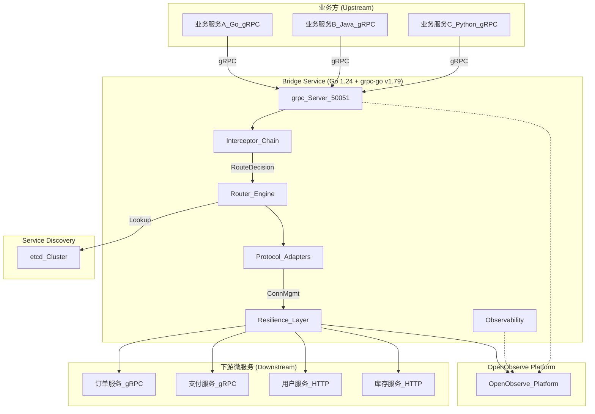

# 【go grpc bridge服务架构设计与实现】

> **版本**: v3.0 (2026-06-13)  
> **Go版本**: 1.24+  
> **依赖更新**: 所有包升级至2026年最新稳定版本，修复已知CVE

---

## 目录

1. [架构概述](#1-架构概述)
2. [项目结构](#2-项目结构)
3. [Protobuf 定义](#3-protobuf-定义)
4. [核心模块实现](#4-核心模块实现)
5. [服务入口与启动](#5-服务入口与启动)
6. [配置文件](#6-配置文件)
7. [Makefile 与构建](#7-makefile-与构建)
8. [部署方案](#8-部署方案)
9. [调用方式与接入指南](#9-调用方式与接入指南)
10. [性能优化清单](#10-性能优化清单)
11. [附录：关键设计决策](#11-附录关键设计决策)

---

## 1. 架构概述

### 1.1 设计目标

Bridge 服务作为**业务方与下游微服务之间的统一代理层**，承担以下核心职责：

- **统一协议入口**：业务方通过 **gRPC 协议** 调用 Bridge，Bridge 负责转发到下游不同协议的微服务
- **动态路由**：基于 etcd 服务发现，支持权重、灰度、区域亲和
- **稳定性保障**：熔断、限流、重试、超时，防止级联故障
- **协议透明**：Bridge 对外统一暴露 gRPC 接口，内部根据配置转发到下游 gRPC/HTTP 服务
- **可观测性**：全链路 Trace + 结构化日志 + Prometheus 指标，直连 OpenObserve

### 1.2 整体架构



### 1.3 核心数据流


### 1.4 技术选型（2026年最新版本）

| 组件 | 选型 | 版本 | 理由 |
|------|------|------|------|
| gRPC 框架 (对外) | `google.golang.org/grpc` | **v1.79.3+** | 修复 CVE-2026-33186 (Critical)，官方最新稳定版 |
| gRPC 客户端 (对内) | `google.golang.org/grpc` | **v1.79.3+** | 同上，Bridge 作为客户端连接下游 gRPC |
| Protobuf | `google.golang.org/protobuf` | **v1.36.0+** | 与 grpc-go v1.79 兼容的最新版本 |
| etcd 客户端 | `go.etcd.io/etcd/client/v3` | **v3.5.21+** | 2026年最新稳定版，与 etcd 3.5.x 集群兼容 |
| 熔断器 | `github.com/sony/gobreaker/v2` | **v2.4.0** | 2026年最新，支持 Go 1.24 |
| 限流 | `golang.org/x/time/rate` | **v0.13.0+** | 标准扩展，Go 1.24 兼容 |
| 可观测性 | `go.opentelemetry.io/otel` | **v1.43.0+** | 修复 CVE-2026-39882/39883，最新稳定版 |
| 日志 | `github.com/rs/zerolog` | **v1.34.0+** | 2026年最新，零分配 JSON 日志 |
| HTTP 客户端 | `github.com/go-resty/resty/v2` | **v2.16.0+** | 功能丰富的 HTTP 客户端，支持中间件、重试、拦截器 |
| 配置 | `github.com/spf13/viper` | **v1.20.0+** | 2026年最新，支持热更新 |
| Prometheus 客户端 | `github.com/prometheus/client_golang` | **v1.22.0+** | 2026年最新，支持新指标类型 |
| Go 版本 | `Go` | **1.24+** | 2026年4月发布，支持新特性 |

---

## 2. 项目结构

```
bridge-svc/
├── api/
│   └── v1/
│       ├── bridge.proto          # Bridge 对外 gRPC API 定义
│       ├── bridge.pb.go          # protoc-gen-go 生成
│       └── bridge_grpc.pb.go     # protoc-gen-go-grpc 生成
├── cmd/
│   └── bridge/
│       └── main.go               # 服务入口
├── internal/
│   ├── config/
│   │   └── config.go             # 配置结构 + 热更新
│   ├── server/
│   │   └── server.go             # grpc.Server 组装 + BridgeService 实现
│   ├── router/
│   │   ├── router.go             # 路由决策
│   │   ├── discovery.go          # etcd 服务发现
│   │   ├── cache.go              # 本地缓存 + watch
│   │   └── balancer.go           # 加权轮询负载均衡
│   ├── protocol/
│   │   ├── protocol.go           # 协议处理器接口
│   │   ├── grpc.go               # gRPC → gRPC 透传 (下游也是 gRPC)
│   │   ├── http.go               # gRPC → HTTP 转换 (使用 resty/v2)
│   ├── resilience/
│   │   ├── circuit.go            # 熔断器管理
│   │   ├── retry.go              # 重试策略
│   │   └── ratelimit.go          # 限流器
│   ├── pool/
│   │   └── grpcpool.go           # gRPC 连接管理
│   ├── observability/
│   │   ├── tracing.go            # OpenTelemetry Trace
│   │   ├── metrics.go            # Prometheus 指标
│   │   └── logging.go            # zerolog 初始化
│   └── middleware/
│       ├── chain.go              # 拦截器链组装
│       ├── auth.go               # 认证拦截器
│       ├── recovery.go           # Panic 恢复
│       ├── logging.go            # 日志拦截器
│       └── timeout.go            # 超时拦截器
├── pkg/
│   └── utils/
│       └── any.go                # protobuf Any 工具函数
├── config/
│   └── bridge.yaml               # 运行时配置
├── go.mod
├── go.sum
└── Makefile
```

---

## 3. Protobuf 定义

### 3.1 `api/v1/bridge.proto`

```protobuf
syntax = "proto3";
package bridge.v1;

import "google/protobuf/any.proto";
import "google/rpc/status.proto";

option go_package = "github.com/daheige/bridge-svc/api/v1;bridgev1";

// 自定义 Status 消息
// 无需外部 googleapis 依赖

// Bridge 对外暴露的统一 gRPC 调用接口
// 业务方通过 gRPC 调用 Bridge，Bridge 负责转发到下游微服务
service BridgeService {
  // 一元调用：适用于大多数业务请求
  rpc CallUnary(UnaryRequest) returns (UnaryResponse);

  // 流式调用：适用于大数据量或实时推送场景（预留）
  rpc CallStream(stream StreamRequest) returns (stream StreamResponse);

  // 健康检查
  rpc Health(HealthRequest) returns (HealthResponse);
}

// 统一请求模型
// 业务方通过 gRPC 发送此请求，Bridge 解析 target 后路由到下游
message UnaryRequest {
  // 目标服务标识，格式: "PackageName.ServiceName/MethodName"
  // 对应 gRPC 的 full method name，例如: "Hello.Greeter/SayHello"
  // Bridge 解析后，使用 "PackageName.ServiceName" 作为 etcd 服务名，"MethodName" 作为方法名
  string target = 1;

  // 下游协议类型：GRPC / HTTP
  // Bridge 根据此字段选择对应的协议处理器转发请求
  string protocol = 2;

  // 业务负载，使用 Any 实现零拷贝透传
  // 业务方将原始 protobuf Message 打包为 Any，Bridge 不感知具体 Schema
  google.protobuf.Any payload = 3;

  // 调用元数据，透传给下游微服务（如 auth token、trace context、region 等）
  map<string, string> metadata = 4;

  // 超时配置（毫秒），覆盖全局默认值
  // 控制 Bridge 到下游微服务的调用超时
  uint32 timeout_ms = 5;

  // 重试策略
  RetryPolicy retry = 6;
}

message RetryPolicy {
  uint32 max_attempts = 1;       // 最大重试次数
  uint32 initial_backoff_ms = 2;   // 初始退避时间
  float backoff_multiplier = 3;    // 退避乘数
  repeated int32 retryable_codes = 4; // 可重试的 gRPC 状态码
}

message UnaryResponse {
  // 成功响应负载（下游微服务返回的数据）
  google.protobuf.Any payload = 1;

  // 响应元数据（从下游微服务透传回来）
  map<string, string> metadata = 2;

  // 如果调用失败，使用自定义 Status 错误模型
  // 包含路由失败、熔断打开、下游超时等错误
  google.rpc.Status status = 3;

  // 实际调用的下游微服务节点（用于调试和链路追踪）
  string upstream_node = 4;

  // 调用耗时（微秒），从 Bridge 接收到请求到返回响应的总时间
  uint64 latency_us = 5;
}

message StreamRequest {
  string target = 1;
  string protocol = 2;
  google.protobuf.Any payload = 3;
  map<string, string> metadata = 4;
}

message StreamResponse {
  google.protobuf.Any payload = 1;
  map<string, string> metadata = 2;
  google.rpc.Status status = 3;
}

message HealthRequest {
  string service = 1; // 空则检查 Bridge 自身
}

message HealthResponse {
  enum ServingStatus {
    UNKNOWN = 0;
    SERVING = 1;
    NOT_SERVING = 2;
  }
  ServingStatus status = 1;
  repeated string checked_services = 2;
}
```

### 3.2 生成命令（2026年最新工具链）

```bash
# 安装 protoc 插件（2026年最新版本）
go install google.golang.org/protobuf/cmd/protoc-gen-go@v1.36.0
go install google.golang.org/grpc/cmd/protoc-gen-go-grpc@v1.5.1

# 生成 Go 代码
protoc \
  --go_out=. --go_opt=paths=source_relative \
  --go-grpc_out=. --go-grpc_opt=paths=source_relative \
  api/v1/bridge.proto
```

---

## 4. 核心模块实现

### 4.1 `go.mod`（2026年最新依赖版本）

```go
module github.com/daheige/bridge-svc

go 1.24

require (
    // gRPC 核心（2026年最新，修复 CVE-2026-33186）
    google.golang.org/grpc v1.79.3
    google.golang.org/protobuf v1.36.0
    google.golang.org/genproto/googleapis/rpc v0.0.0-20250609180819-5d3f8f7b8b8b

    // etcd 客户端（2026年最新稳定版）
    go.etcd.io/etcd/client/v3 v3.5.21

    // OpenTelemetry（2026年最新，修复 CVE-2026-39882/39883）
    go.opentelemetry.io/otel v1.43.0
    go.opentelemetry.io/otel/sdk v1.43.0
    go.opentelemetry.io/otel/trace v1.43.0
    go.opentelemetry.io/otel/exporters/otlp/otlptrace/otlptracegrpc v1.43.0
    go.opentelemetry.io/otel/exporters/prometheus v0.56.0

    // 熔断器（2026年最新 v2.4.0）
    github.com/sony/gobreaker/v2 v2.4.0

    // 日志（2026年最新）
    github.com/rs/zerolog v1.34.0

    // 配置管理（2026年最新）
    github.com/spf13/viper v1.20.0

    // HTTP 客户端（功能丰富的 REST 客户端）
    github.com/go-resty/resty/v2 v2.16.0

    // Prometheus 客户端（2026年最新）
    github.com/prometheus/client_golang v1.22.0

    // 限流（Go 1.24 兼容）
    golang.org/x/time v0.13.0

    // 工具库
    github.com/google/uuid v1.6.0
)
```

### 4.2 `internal/config/config.go`

```go
package config

import (
	"fmt"
	"sync"
	"time"

	"github.com/fsnotify/fsnotify"
	"github.com/rs/zerolog/log"
	"github.com/spf13/viper"
)

// Config 全局配置结构
type Config struct {
	Server        ServerConfig        `mapstructure:"server"`
	Etcd          EtcdConfig          `mapstructure:"etcd"`
	Protocols     ProtocolConfig      `mapstructure:"protocols"`
	Resilience    ResilienceConfig    `mapstructure:"resilience"`
	Observability ObservabilityConfig `mapstructure:"observability"`
}

// ServerConfig gRPC 服务器配置（业务方通过此端口调用 Bridge）
type ServerConfig struct {
	ListenAddr           string        `mapstructure:"listen_addr"`            // 监听地址，如 "0.0.0.0:50051"
	MaxConcurrentStreams uint32        `mapstructure:"max_concurrent_streams"` // 最大并发流
	KeepaliveTime        time.Duration `mapstructure:"keepalive_time"`         // 连接保活时间
	KeepaliveTimeout     time.Duration `mapstructure:"keepalive_timeout"`      // 保活超时
}

// EtcdConfig etcd 服务发现配置
type EtcdConfig struct {
	Endpoints   []string      `mapstructure:"endpoints"`   // etcd 集群地址
	DialTimeout time.Duration `mapstructure:"dial_timeout"` // 连接超时
	Prefix      string        `mapstructure:"prefix"`       // 服务注册前缀
}

// ProtocolConfig 协议层配置（Bridge 到下游微服务的协议配置）
type ProtocolConfig struct {
	DefaultTimeout time.Duration `mapstructure:"default_timeout"` // 默认超时
	Grpc           GrpcConfig    `mapstructure:"grpc"`          // gRPC 下游配置
	HTTP           HTTPConfig    `mapstructure:"http"`          // HTTP 下游配置
}

// GrpcConfig gRPC 客户端配置（Bridge 作为客户端连接下游 gRPC 服务）
type GrpcConfig struct {
	MaxSendMsgSize int           `mapstructure:"max_send_msg_size"` // 最大发送消息大小
	MaxRecvMsgSize int           `mapstructure:"max_recv_msg_size"` // 最大接收消息大小
	DialTimeout    time.Duration `mapstructure:"dial_timeout"`      // 连接超时
}

// HTTPConfig HTTP 客户端配置（Bridge 作为客户端连接下游 HTTP 服务）
type HTTPConfig struct {
	MaxConnsPerHost int           `mapstructure:"max_conns_per_host"` // 每主机最大连接数
	ReadTimeout     time.Duration `mapstructure:"read_timeout"`       // 读超时
	WriteTimeout    time.Duration `mapstructure:"write_timeout"`      // 写超时
}

// ResilienceConfig 稳定性保障配置
type ResilienceConfig struct {
	CircuitBreaker CircuitBreakerConfig `mapstructure:"circuit_breaker"` // 熔断器
	RateLimiter    RateLimiterConfig    `mapstructure:"rate_limiter"`    // 限流器
	Retry          RetryConfig          `mapstructure:"retry"`           // 重试策略
}

// CircuitBreakerConfig 熔断器配置
type CircuitBreakerConfig struct {
	MaxRequests  uint32        `mapstructure:"max_requests"`  // 半开状态最大请求数
	Interval     time.Duration `mapstructure:"interval"`      // 统计周期
	Timeout      time.Duration `mapstructure:"timeout"`       // 熔断持续时间
	FailureRatio float64       `mapstructure:"failure_ratio"` // 触发熔断的失败率阈值
	SuccessRatio float64       `mapstructure:"success_ratio"` // 恢复熔断的成功率阈值
	HalfOpenMax  uint32        `mapstructure:"half_open_max"` // 半开状态最大探测请求
}

// RateLimiterConfig 限流器配置
type RateLimiterConfig struct {
	RPS       int `mapstructure:"rps"`        // 每秒请求数
	BurstSize int `mapstructure:"burst_size"` // 突发容量
}

// RetryConfig 重试策略配置
type RetryConfig struct {
	MaxAttempts       uint32        `mapstructure:"max_attempts"`       // 最大重试次数
	InitialBackoff    time.Duration `mapstructure:"initial_backoff"`    // 初始退避时间
	MaxBackoff        time.Duration `mapstructure:"max_backoff"`        // 最大退避时间
	BackoffMultiplier float64       `mapstructure:"backoff_multiplier"` // 退避乘数
}

// ObservabilityConfig 可观测性配置
type ObservabilityConfig struct {
	LogLevel       string `mapstructure:"log_level"`       // 日志级别
	TraceEndpoint  string `mapstructure:"trace_endpoint"`  // OTLP Trace 接收端
	MetricsPort    int    `mapstructure:"metrics_port"`    // Prometheus 指标端口
	ServiceName    string `mapstructure:"service_name"`    // 服务名
	ServiceVersion string `mapstructure:"service_version"` // 服务版本
}

var (
	instance *Config
	mu       sync.RWMutex
)

// Load 加载配置文件，支持热更新
func Load(path string) (*Config, error) {
	v := viper.New()
	v.SetConfigFile(path)
	v.SetEnvPrefix("BRIDGE")
	v.AutomaticEnv()

	if err := v.ReadInConfig(); err != nil {
		return nil, fmt.Errorf("read config: %w", err)
	}

	var cfg Config
	if err := v.Unmarshal(&cfg); err != nil {
		return nil, fmt.Errorf("unmarshal config: %w", err)
	}

	// 热更新监听
	v.OnConfigChange(func(in fsnotify.Event) {
		var newCfg Config
		if err := v.Unmarshal(&newCfg); err != nil {
			log.Error().Err(err).Msg("config hot reload failed")
			return
		}
		mu.Lock()
		instance = &newCfg
		mu.Unlock()
		log.Info().Msg("config reloaded")
	})
	v.WatchConfig()

	instance = &cfg
	return &cfg, nil
}

// Get 获取当前配置（线程安全）
func Get() *Config {
	mu.RLock()
	defer mu.RUnlock()
	return instance
}
```

### 4.3 `internal/router/router.go`

```go
package router

import (
	"context"
	"encoding/json"
	"fmt"
	"strings"
	"sync"

	"github.com/rs/zerolog/log"
	"go.etcd.io/etcd/client/v3"
	"google.golang.org/grpc/metadata"
)

// ProtocolType 下游微服务协议类型
type ProtocolType string

const (
	ProtocolGRPC   ProtocolType = "GRPC"   // 下游是 gRPC 服务
	ProtocolHTTP   ProtocolType = "HTTP"   // 下游是 HTTP/REST 服务
	 
)

// Endpoint 下游微服务节点
type Endpoint struct {
	Address  string            `json:"address"`  // 下游服务地址，如 "10.0.1.5:50051"
	Weight   uint32            `json:"weight"`   // 权重，用于负载均衡
	Protocol ProtocolType      `json:"protocol"` // 协议类型
	Region   string            `json:"region"`   // 区域，如 "cn-north-1"
	Tags     map[string]string `json:"tags"`     // 标签，如 {"version": "v2"}
	Healthy  bool              `json:"healthy"`  // 健康状态
}

// RouteContext 路由上下文（从业务方请求中提取）
type RouteContext struct {
	Target       string       // 目标服务路径，如 "order_service/CreateOrder"
	Protocol     ProtocolType // 协议类型
	Metadata     metadata.MD  // 元数据，透传给下游
	PreferRegion string       // 优先区域
	Canary       string       // 灰度标识
}

// RouteTarget 路由结果（选中的下游微服务节点）
type RouteTarget struct {
	ServiceName string   // 服务名，如 "Hello.Greeter"（gRPC full method name 的 service 部分）
	MethodName  string   // 方法名，如 "SayHello"
	Endpoint    Endpoint // 选中的节点
}

// Router 路由引擎
type Router struct {
	client   *clientv3.Client
	cache    *sync.Map // serviceKey -> []Endpoint
	balancer LoadBalancer
	prefix   string
}

// New 创建路由引擎，初始化 etcd 连接并启动 watch
func New(cfg *EtcdConfig) (*Router, error) {
	cli, err := clientv3.New(clientv3.Config{
		Endpoints:   cfg.Endpoints,
		DialTimeout: cfg.DialTimeout,
	})
	if err != nil {
		return nil, fmt.Errorf("etcd connect: %w", err)
	}

	r := &Router{
		client:   cli,
		cache:    &sync.Map{},
		balancer: NewWeightedRoundRobin(),
		prefix:   cfg.Prefix,
	}

	// 启动全量加载 + watch
	if err := r.bootstrap(); err != nil {
		return nil, err
	}
	go r.watch()

	return r, nil
}

// parseTarget 解析 gRPC full method name
// 格式: "PackageName.ServiceName/MethodName"
// 例如: "Hello.Greeter/SayHello" → service="Hello.Greeter", method="SayHello"
// etcd 中的服务名就是 "PackageName.ServiceName"（如 "Hello.Greeter"）
func parseTarget(target string) (service, method string) {
	parts := strings.Split(target, "/")
	if len(parts) == 2 {
		return parts[0], parts[1] // service="Hello.Greeter", method="SayHello"
	}
	return target, ""
}

// Route 执行路由决策：根据 target 找到对应的下游微服务节点
func (r *Router) Route(ctx context.Context, routeCtx RouteContext) (*RouteTarget, error) {

	service, method := parseTarget(routeCtx.Target)
	key := r.serviceKey(service)

	// 1. 读本地缓存
	val, ok := r.cache.Load(key)
	if !ok {
		// 2. 缓存未命中，回源 etcd
		endpoints, err := r.lookupFromEtcd(ctx, service, version)
		if err != nil {
			return nil, fmt.Errorf("lookup etcd: %w", err)
		}
		r.cache.Store(key, endpoints)
		val = endpoints
	}

	endpoints := val.([]Endpoint)
	healthy := filterHealthy(endpoints)
	if len(healthy) == 0 {
		return nil, fmt.Errorf("no healthy endpoint for %s", routeCtx.Target)
	}

	// 3. 负载均衡选择节点
	selected := r.balancer.Select(healthy, routeCtx)

	return &RouteTarget{
		ServiceName: service,
		MethodName:  method,
		Endpoint:    selected,
	}, nil
}

func (r *Router) serviceKey(service string) string {
	return fmt.Sprintf("%s%s/default", r.prefix, service)
}

func (r *Router) lookupFromEtcd(ctx context.Context, service string) ([]Endpoint, error) {
	key := r.serviceKey(service)
	resp, err := r.client.Get(ctx, key)
	if err != nil {
		return nil, err
	}

	var endpoints []Endpoint
	for _, kv := range resp.Kvs {
		var eps []Endpoint
		if err := json.Unmarshal(kv.Value, &eps); err != nil {
			log.Warn().Err(err).Str("key", string(kv.Key)).Msg("unmarshal endpoint failed")
			continue
		}
		endpoints = append(endpoints, eps...)
	}

	return endpoints, nil
}

// watch 持续监听 etcd 变更，增量更新本地缓存
func (r *Router) watch() {
	watchChan := r.client.Watch(context.Background(), r.prefix, clientv3.WithPrefix())
	for wresp := range watchChan {
		for _, ev := range wresp.Events {
			switch ev.Type {
			case clientv3.EventTypePut:
				var eps []Endpoint
				if err := json.Unmarshal(ev.Kv.Value, &eps); err != nil {
					continue
				}
				r.cache.Store(string(ev.Kv.Key), eps)
			case clientv3.EventTypeDelete:
				r.cache.Delete(string(ev.Kv.Key))
			}
		}
	}
}

// bootstrap 启动时全量加载 etcd 数据到本地缓存
func (r *Router) bootstrap() error {
	resp, err := r.client.Get(context.Background(), r.prefix, clientv3.WithPrefix())
	if err != nil {
		return err
	}
	for _, kv := range resp.Kvs {
		var eps []Endpoint
		if err := json.Unmarshal(kv.Value, &eps); err != nil {
			continue
		}
		r.cache.Store(string(kv.Key), eps)
	}
	return nil
}

func filterHealthy(endpoints []Endpoint) []Endpoint {
	var result []Endpoint
	for _, ep := range endpoints {
		if ep.Healthy {
			result = append(result, ep)
		}
	}
	return result
}
```

### 4.4 `internal/router/balancer.go`

```go
package router

import (
	"sync/atomic"
)

// LoadBalancer 负载均衡接口
type LoadBalancer interface {
	Select(endpoints []Endpoint, ctx RouteContext) Endpoint
}

// WeightedRoundRobin 加权轮询负载均衡器
type WeightedRoundRobin struct {
	counter uint64
}

// NewWeightedRoundRobin 创建加权轮询器
func NewWeightedRoundRobin() *WeightedRoundRobin {
	return &WeightedRoundRobin{}
}

// Select 按权重选择下游节点
func (w *WeightedRoundRobin) Select(endpoints []Endpoint, ctx RouteContext) Endpoint {
	totalWeight := uint32(0)
	for _, ep := range endpoints {
		totalWeight += ep.Weight
	}

	if totalWeight == 0 {
		return endpoints[0]
	}

	count := atomic.AddUint64(&w.counter, 1)
	pos := uint32((count - 1) % uint64(totalWeight))

	var current uint32
	for _, ep := range endpoints {
		current += ep.Weight
		if pos < current {
			return ep
		}
	}

	return endpoints[0]
}
```

### 4.5 `internal/protocol/protocol.go`

```go
package protocol

import (
	"context"
	"time"

	"github.com/daheige/bridge-svc/internal/router"
	"google.golang.org/grpc/metadata"
	"google.golang.org/protobuf/types/known/anypb"
)

// Handler 协议处理器接口
// Bridge 根据下游微服务的协议类型，选择对应的 Handler 进行转发
type Handler interface {
	// Call 执行协议转发
	// ctx: 上下文
	// target: 路由目标（下游微服务节点信息）
	// payload: 业务负载（从业务方请求中透传）
	// md: 元数据（从业务方请求中透传）
	// timeout: 超时时间
	Call(ctx context.Context, target *router.RouteTarget, payload *anypb.Any, md metadata.MD, timeout time.Duration) (*Response, error)
}

// Response 统一响应结构（从下游微服务返回）
type Response struct {
	Payload   *anypb.Any  // 响应负载
	Metadata  metadata.MD // 响应元数据
	LatencyUs uint64      // 调用耗时（微秒）
}

// Factory 创建对应协议的处理器
// 根据下游微服务的协议类型，创建对应的 Handler
func Factory(protocol router.ProtocolType) Handler {
	switch protocol {
	case router.ProtocolGRPC:
		return NewGRPCHandler() // 下游是 gRPC 服务
	case router.ProtocolHTTP:
		return NewHTTPHandler() // 下游是 HTTP 服务
		default:
		return nil
	}
}
```

### 4.6 `internal/protocol/grpc.go`

```go
package protocol

import (
	"context"
	"fmt"
	"time"

	"github.com/daheige/bridge-svc/internal/pool"
	"github.com/daheige/bridge-svc/internal/router"
	"google.golang.org/grpc"
	"google.golang.org/grpc/metadata"
	"google.golang.org/protobuf/types/known/anypb"
)

// GRPCHandler gRPC 协议透传处理器
// 业务方 -> Bridge(gRPC) -> 下游 gRPC 微服务
// 此 Handler 负责将 Bridge 接收到的 gRPC 请求转发到下游 gRPC 服务
type GRPCHandler struct {
	pool *pool.GRPCPool // gRPC 连接池，复用到下游的连接
}

// NewGRPCHandler 创建 gRPC 处理器
func NewGRPCHandler() *GRPCHandler {
	return &GRPCHandler{
		pool: pool.NewGRPCPool(),
	}
}

// Call 执行 gRPC 透传调用
// 1. 从连接池获取到下游 gRPC 服务的连接
// 2. 构建 gRPC 方法路径（/PackageName.ServiceName/MethodName）
// 3. 透传 metadata（trace context、auth token 等）
// 4. 使用 *anypb.Any 透传 payload，Bridge 不感知具体业务类型
// 5. 调用下游服务并返回响应
func (h *GRPCHandler) Call(ctx context.Context, target *router.RouteTarget, payload *anypb.Any, md metadata.MD, timeout time.Duration) (*Response, error) {
	start := time.Now()

	// 1. 从连接池获取或创建到下游 gRPC 服务的连接
	conn, err := h.pool.Get(ctx, target.Endpoint.Address)
	if err != nil {
		return nil, fmt.Errorf("get connection to downstream %s: %w", target.Endpoint.Address, err)
	}
	defer h.pool.Put(conn)

	// 2. 构建 gRPC 方法路径（full method name）
	// target.ServiceName 已经是 "PackageName.ServiceName" 格式
	// target.MethodName 是 "MethodName"
	method := fmt.Sprintf("/%s/%s", target.ServiceName, target.MethodName)

	// 3. 透传 metadata 到下游（包含 trace context、auth token 等）
	ctx = metadata.NewOutgoingContext(ctx, md)

	// 4. 设置超时
	ctx, cancel := context.WithTimeout(ctx, timeout)
	defer cancel()

	// 5. 使用 *anypb.Any 透传业务消息
	// Bridge 不感知具体的业务类型，直接透传 Any 到下游
	// 下游服务会根据自己的 proto 定义解析 Any 中的 Value
	var resp anypb.Any
	err = conn.Invoke(ctx, method, payload, &resp)

	latency := uint64(time.Since(start).Microseconds())

	if err != nil {
		return nil, fmt.Errorf("invoke downstream %s: %w", method, err)
	}

	return &Response{
		Payload:   &resp,
		Metadata:  metadata.MD{}, // 可从 response trailer 提取
		LatencyUs: latency,
	}, nil
}
```

### 4.7 `internal/protocol/http.go`

```go
package protocol

import (
	"context"
	"fmt"
	"strings"
	"time"

	"github.com/go-resty/resty/v2"
	"github.com/daheige/bridge-svc/internal/router"
	"google.golang.org/grpc/metadata"
	"google.golang.org/protobuf/types/known/anypb"
)

// HTTPHandler gRPC to HTTP 协议转换处理器
// 业务方 -> Bridge(gRPC) -> 下游 HTTP/REST 微服务
// 使用 resty/v2 作为 HTTP 客户端，支持中间件、重试、拦截器
type HTTPHandler struct {
	client *resty.Client // resty HTTP 客户端
}

// NewHTTPHandler 创建 HTTP 处理器
func NewHTTPHandler() *HTTPHandler {
	client := resty.New()
	client.SetTimeout(10 * time.Second)
	client.SetRetryCount(3)
	client.SetRetryWaitTime(100 * time.Millisecond)

	return &HTTPHandler{
		client: client,
	}
}

// Call 执行 gRPC to HTTP 转换调用
// 1. 将 gRPC 请求转换为 HTTP 请求
// 2. 透传 metadata 为 HTTP header
// 3. 发送 HTTP 请求到下游服务
// 4. 将 HTTP 响应转换为 gRPC 响应格式
func (h *HTTPHandler) Call(ctx context.Context, target *router.RouteTarget, payload *anypb.Any, md metadata.MD, timeout time.Duration) (*Response, error) {
	start := time.Now()

	// 构建请求 URL: http://host:port/service_name/method_name
	url := fmt.Sprintf("http://%s/%s/%s", target.Endpoint.Address, target.ServiceName, target.MethodName)

	// 创建带上下文的请求
	req := h.client.R().SetContext(ctx)

	// 透传 metadata 为 HTTP header（如 trace context、auth token）
	for k, v := range md {
		if len(v) > 0 {
			req.SetHeader(k, v[0])
		}
	}

	// 设置 Content-Type 和 payload
	req.SetHeader("Content-Type", "application/octet-stream")
	if payload != nil {
		req.SetBody(payload.Value)
	}

	// 执行 HTTP POST 请求
	resp, err := req.Post(url)
	latency := uint64(time.Since(start).Microseconds())

	if err != nil {
		return nil, fmt.Errorf("http call to %s: %w", target.Endpoint.Address, err)
	}

	// 将 HTTP 响应体转换为 Any（透传回业务方）
	result := &anypb.Any{
		Value: resp.Body(),
	}

	return &Response{
		Payload:   result,
		Metadata:  metadata.MD{},
		LatencyUs: latency,
	}, nil
}
```

### 4.8 `internal/pool/grpcpool.go`

```go
package pool

import (
	"context"
	"fmt"
	"strings"
	"sync"
	"time"

	"google.golang.org/grpc"
	"google.golang.org/grpc/connectivity"
	"google.golang.org/grpc/credentials/insecure"
	"google.golang.org/grpc/keepalive"
)

// GRPCPool gRPC 连接池
// 管理 Bridge 到下游 gRPC 微服务的连接，实现连接复用
type GRPCPool struct {
	mu    sync.RWMutex
	conns map[string]*grpc.ClientConn // key: 下游地址, value: gRPC 连接
}

// NewGRPCPool 创建连接池
func NewGRPCPool() *GRPCPool {
	return &GRPCPool{
		conns: make(map[string]*grpc.ClientConn),
	}
}

// Get 获取或创建到下游 gRPC 服务的连接
func (p *GRPCPool) Get(ctx context.Context, addr string) (*grpc.ClientConn, error) {
	// 清理地址中的 http:// 或 https:// 前缀（gRPC 不需要）
	addr = strings.TrimPrefix(addr, "http://")
	addr = strings.TrimPrefix(addr, "https://")

	p.mu.RLock()
	conn, ok := p.conns[addr]
	p.mu.RUnlock()

	if ok && p.isHealthy(conn) {
		return conn, nil
	}

	// 创建新连接
	p.mu.Lock()
	defer p.mu.Unlock()

	// 双重检查
	if conn, ok := p.conns[addr]; ok && p.isHealthy(conn) {
		return conn, nil
	}

	newConn, err := grpc.NewClient(addr,
		grpc.WithTransportCredentials(insecure.NewCredentials()),
		grpc.WithDefaultServiceConfig(`{"loadBalancingPolicy":"round_robin"}`),
		grpc.WithKeepaliveParams(keepalive.ClientParameters{
			Time:    10 * time.Second,
			Timeout: 3 * time.Second,
		}),
		grpc.WithDefaultCallOptions(
			grpc.MaxCallRecvMsgSize(16<<20), // 16MB
			grpc.MaxCallSendMsgSize(16<<20),
		),
	)
	if err != nil {
		return nil, fmt.Errorf("dial %s: %w", addr, err)
	}

	p.conns[addr] = newConn
	return newConn, nil
}

// Put 归还连接（gRPC 连接长期复用，无需真正归还）
func (p *GRPCPool) Put(conn *grpc.ClientConn) {
	// gRPC 连接长期复用，这里仅做健康检查占位
}

func (p *GRPCPool) isHealthy(conn *grpc.ClientConn) bool {
	state := conn.GetState()
	return state == connectivity.Ready || state == connectivity.Idle
}

// Close 关闭所有连接
func (p *GRPCPool) Close() {
	p.mu.Lock()
	defer p.mu.Unlock()
	for _, conn := range p.conns {
		conn.Close()
	}
}
```

### 4.9 `internal/resilience/circuit.go`

```go
package resilience

import (
	"errors"
	"sync"

	"github.com/sony/gobreaker/v2"
	"github.com/daheige/bridge-svc/internal/config"
)

// ErrCircuitOpen 熔断器打开错误
var ErrCircuitOpen = errors.New("circuit breaker is open")

// CircuitBreakerManager 熔断器管理器
// 按下游微服务 endpoint 维度管理熔断器，保护 Bridge 不被故障下游拖垮
// 使用 gobreaker/v2 的泛型类型 CircuitBreaker[T any]
type CircuitBreakerManager struct {
	breakers sync.Map // endpoint -> *gobreaker.CircuitBreaker[interface{}]
	cfg      config.CircuitBreakerConfig
}

// NewCircuitBreakerManager 创建熔断器管理器
func NewCircuitBreakerManager(cfg config.CircuitBreakerConfig) *CircuitBreakerManager {
	return &CircuitBreakerManager{cfg: cfg}
}

// Get 获取或创建指定下游 endpoint 的熔断器
// gobreaker/v2 使用泛型类型 CircuitBreaker[T any]
func (m *CircuitBreakerManager) Get(endpoint string) *gobreaker.CircuitBreaker[interface{}] {
	if cb, ok := m.breakers.Load(endpoint); ok {
		return cb.(*gobreaker.CircuitBreaker[interface{}])
	}

	settings := gobreaker.Settings{
		Name:        endpoint,
		MaxRequests: m.cfg.HalfOpenMax,
		Interval:    m.cfg.Interval,
		Timeout:     m.cfg.Timeout,
		ReadyToTrip: func(counts gobreaker.Counts) bool {
			failureRatio := float64(counts.TotalFailures) / float64(counts.Requests)
			return counts.Requests >= 3 && failureRatio >= m.cfg.FailureRatio
		},
		OnStateChange: func(name string, from gobreaker.State, to gobreaker.State) {
			// TODO: 记录状态变化到日志/指标
		},
	}

	cb := gobreaker.NewCircuitBreaker[interface{}](settings)
	actual, _ := m.breakers.LoadOrStore(endpoint, cb)
	return actual.(*gobreaker.CircuitBreaker[interface{}])
}

// Execute 在熔断器保护下执行函数
// 如果熔断器打开，直接返回 ErrCircuitOpen，避免请求故障下游
func (m *CircuitBreakerManager) Execute(endpoint string, fn func() (interface{}, error)) (interface{}, error) {
	cb := m.Get(endpoint)
	result, err := cb.Execute(fn)
	if err == gobreaker.ErrOpenState {
		return nil, ErrCircuitOpen
	}
	return result, err
}
```

### 4.10 `internal/resilience/retry.go`

```go
package resilience

import (
	"context"
	"fmt"
	"time"

	"google.golang.org/grpc/codes"
	"google.golang.org/grpc/status"
)

// RetryableFunc 可重试函数签名
type RetryableFunc func() error

// RetryConfig 重试配置
type RetryConfig struct {
	MaxAttempts       uint32
	InitialBackoff    time.Duration
	MaxBackoff        time.Duration
	BackoffMultiplier float64
	RetryableCodes    []codes.Code
}

// DoRetry 执行带重试的函数
// 对下游调用失败进行重试，支持指数退避
func DoRetry(ctx context.Context, cfg RetryConfig, fn RetryableFunc) error {
	var lastErr error
	backoff := cfg.InitialBackoff

	for attempt := uint32(0); attempt < cfg.MaxAttempts; attempt++ {
		if err := fn(); err != nil {
			lastErr = err

			// 检查是否可重试
			if !isRetryable(err, cfg.RetryableCodes) {
				return err
			}

			// 最后一次尝试，不再等待
			if attempt == cfg.MaxAttempts-1 {
				break
			}

			// 等待后重试
			select {
			case <-ctx.Done():
				return ctx.Err()
			case <-time.After(backoff):
				backoff = minDuration(
					time.Duration(float64(backoff)*cfg.BackoffMultiplier),
					cfg.MaxBackoff,
				)
			}
		} else {
			return nil
		}
	}

	return fmt.Errorf("max retries exceeded: %w", lastErr)
}

func isRetryable(err error, retryableCodes []codes.Code) bool {
	st, ok := status.FromError(err)
	if !ok {
		return false
	}
	for _, code := range retryableCodes {
		if st.Code() == code {
			return true
		}
	}
	return false
}

func minDuration(a, b time.Duration) time.Duration {
	if a < b {
		return a
	}
	return b
}
```

### 4.11 `internal/resilience/ratelimit.go`

```go
package resilience

import (
	"context"
	"errors"

	"golang.org/x/time/rate"
)

// ErrRateLimited 限流错误
var ErrRateLimited = errors.New("rate limited")

// RateLimiter 令牌桶限流器
// 对业务方请求进行限流，保护下游微服务不被突发流量打垮
type RateLimiter struct {
	limiter *rate.Limiter
}

// NewRateLimiter 创建限流器
func NewRateLimiter(rps int, burstSize int) *RateLimiter {
	return &RateLimiter{
		limiter: rate.NewLimiter(rate.Limit(rps), burstSize),
	}
}

// Allow 检查是否允许通过
func (r *RateLimiter) Allow() bool {
	return r.limiter.Allow()
}

// Wait 等待获取令牌
func (r *RateLimiter) Wait(ctx context.Context) error {
	return r.limiter.Wait(ctx)
}
```

### 4.12 `internal/middleware/chain.go`

```go
package middleware

import (
	"context"

	"google.golang.org/grpc"
)

// ChainUnaryServer 组装一元拦截器链
// 将多个拦截器按顺序组合，形成处理链
func ChainUnaryServer(interceptors ...grpc.UnaryServerInterceptor) grpc.UnaryServerInterceptor {
	n := len(interceptors)
	return func(ctx context.Context, req interface{}, info *grpc.UnaryServerInfo, handler grpc.UnaryHandler) (interface{}, error) {
		chain := handler
		for i := n - 1; i >= 0; i-- {
			interceptor := interceptors[i]
			next := chain
			chain = func(currentCtx context.Context, currentReq interface{}) (interface{}, error) {
				return interceptor(currentCtx, currentReq, info, func(nestedCtx context.Context, nestedReq interface{}) (interface{}, error) {
					return next(nestedCtx, nestedReq)
				})
			}
		}
		return chain(ctx, req)
	}
}
```

### 4.13 `internal/middleware/recovery.go`

```go
package middleware

import (
	"context"

	"github.com/rs/zerolog/log"
	"google.golang.org/grpc"
	"google.golang.org/grpc/codes"
	"google.golang.org/grpc/status"
)

// RecoveryInterceptor panic 恢复拦截器
// 捕获业务处理中的 panic，防止单个请求拖垮整个 Bridge 进程
func RecoveryInterceptor(ctx context.Context, req interface{}, info *grpc.UnaryServerInfo, handler grpc.UnaryHandler) (resp interface{}, err error) {
	defer func() {
		if r := recover(); r != nil {
			log.Error().
				Str("method", info.FullMethod).
				Interface("panic", r).
				Msg("panic recovered")
			err = status.Errorf(codes.Internal, "internal error: %v", r)
		}
	}()
	return handler(ctx, req)
}
```

### 4.14 `internal/middleware/logging.go`

```go
package middleware

import (
	"context"
	"time"

	"github.com/rs/zerolog/log"
	"google.golang.org/grpc"
	"google.golang.org/grpc/metadata"
)

// LoggingInterceptor 结构化日志拦截器
// 记录每个业务方请求的详细信息，便于排查问题
func LoggingInterceptor(ctx context.Context, req interface{}, info *grpc.UnaryServerInfo, handler grpc.UnaryHandler) (interface{}, error) {
	start := time.Now()
	md, _ := metadata.FromIncomingContext(ctx)

	resp, err := handler(ctx, req)

	log.Info().
		Str("method", info.FullMethod).
		Dur("duration", time.Since(start)).
		Interface("metadata", md).
		Err(err).
		Msg("unary call")

	return resp, err
}
```

### 4.15 `internal/middleware/auth.go`

```go
package middleware

import (
	"context"
	"strings"

	"google.golang.org/grpc"
	"google.golang.org/grpc/codes"
	"google.golang.org/grpc/metadata"
	"google.golang.org/grpc/status"
)

// AuthInterceptor 认证拦截器（占位实现）
// 验证业务方请求的合法性，可集成 Casbin 或 JWT
func AuthInterceptor(ctx context.Context, req interface{}, info *grpc.UnaryServerInfo, handler grpc.UnaryHandler) (interface{}, error) {
	md, ok := metadata.FromIncomingContext(ctx)
	if !ok {
		return nil, status.Errorf(codes.Unauthenticated, "missing metadata")
	}

	authHeader := md.Get("authorization")
	if len(authHeader) == 0 {
		return nil, status.Errorf(codes.Unauthenticated, "missing authorization header")
	}

	token := strings.TrimPrefix(authHeader[0], "Bearer ")
	if token == "" {
		return nil, status.Errorf(codes.Unauthenticated, "invalid token format")
	}

	// TODO: 集成 Casbin 或 JWT 验证
	// if err := validateToken(token); err != nil { ... }

	return handler(ctx, req)
}
```

### 4.16 `internal/observability/tracing.go`

```go
package observability

import (
	"context"
	"fmt"

	"github.com/daheige/bridge-svc/internal/config"
	"go.opentelemetry.io/otel"
	"go.opentelemetry.io/otel/attribute"
	"go.opentelemetry.io/otel/exporters/otlp/otlptrace/otlptracegrpc"
	"go.opentelemetry.io/otel/propagation"
	"go.opentelemetry.io/otel/sdk/resource"
	sdktrace "go.opentelemetry.io/otel/sdk/trace"
	semconv "go.opentelemetry.io/otel/semconv/v1.26.0"
	"go.opentelemetry.io/otel/trace"
	"google.golang.org/grpc/metadata"
)

var tracer trace.Tracer

// InitTracer 初始化 OpenTelemetry Trace
// 将 Trace 数据通过 OTLP 发送到 OpenObserve
func InitTracer(cfg config.ObservabilityConfig) error {
	if cfg.TraceEndpoint == "" {
		tracer = otel.Tracer("bridge-svc")
		return nil
	}

	exporter, err := otlptracegrpc.New(
		context.Background(),
		otlptracegrpc.WithEndpoint(cfg.TraceEndpoint),
		otlptracegrpc.WithInsecure(),
	)
	if err != nil {
		return fmt.Errorf("create trace exporter: %w", err)
	}

	provider := sdktrace.NewTracerProvider(
		sdktrace.WithBatcher(exporter),
		sdktrace.WithResource(resource.NewWithAttributes(
			semconv.SchemaURL,
			semconv.ServiceName(cfg.ServiceName),
			attribute.String("service.version", cfg.ServiceVersion),
		)),
	)

	otel.SetTracerProvider(provider)
	otel.SetTextMapPropagator(propagation.TraceContext{})
	tracer = provider.Tracer("bridge-svc")

	return nil
}

// ExtractTraceContext 从 gRPC metadata 提取 trace context
// 从业务方请求中提取 trace 信息，实现链路追踪透传
func ExtractTraceContext(ctx context.Context) context.Context {
	md, _ := metadata.FromIncomingContext(ctx)
	carrier := propagation.MapCarrier{}
	for k, v := range md {
		if len(v) > 0 {
			carrier[k] = v[0]
		}
	}
	return otel.GetTextMapPropagator().Extract(ctx, carrier)
}

// StartSpan 启动新 span
func StartSpan(ctx context.Context, name string, opts ...trace.SpanStartOption) (context.Context, trace.Span) {
	return tracer.Start(ctx, name, opts...)
}
```

### 4.17 `internal/observability/logging.go`

```go
package observability

import (
	"os"
	"time"

	"github.com/rs/zerolog"
	"github.com/rs/zerolog/log"
)

// InitLogger 初始化 zerolog
// 零分配 JSON 日志，便于采集到 OpenObserve
func InitLogger(level string) {
	zerolog.TimeFieldFormat = time.RFC3339Nano

	l, err := zerolog.ParseLevel(level)
	if err != nil {
		l = zerolog.InfoLevel
	}

	log.Logger = zerolog.New(os.Stdout).
		Level(l).
		With().
		Timestamp().
		Caller().
		Logger()
}
```

### 4.18 `internal/observability/metrics.go`

```go
package observability

import (
	"github.com/prometheus/client_golang/prometheus"
	"github.com/prometheus/client_golang/prometheus/promauto"
)

var (
	// RequestTotal 请求总数
	// 按方法和状态码统计业务方请求
	RequestTotal = promauto.NewCounterVec(prometheus.CounterOpts{
		Name: "bridge_request_total",
		Help: "Total number of requests from upstream",
	}, []string{"method", "status"})

	// RequestDuration 请求耗时
	// 按方法统计从业务方请求到响应的总耗时
	RequestDuration = promauto.NewHistogramVec(prometheus.HistogramOpts{
		Name:    "bridge_request_duration_seconds",
		Help:    "Request duration in seconds (upstream to downstream)",
		Buckets: prometheus.DefBuckets,
	}, []string{"method"})

	// ActiveConnections 活跃连接数
	// 当前与业务方建立的 gRPC 连接数
	ActiveConnections = promauto.NewGauge(prometheus.GaugeOpts{
		Name: "bridge_active_connections",
		Help: "Number of active connections from upstream",
	})
)
```

### 4.19 `internal/observability/init.go`

```go
package observability

import (
	"fmt"

	"github.com/daheige/bridge-svc/internal/config"
)

// Init 初始化所有可观测性组件
func Init(cfg config.ObservabilityConfig) error {
	InitLogger(cfg.LogLevel)

	if err := InitTracer(cfg); err != nil {
		return fmt.Errorf("init tracer: %w", err)
	}

	return nil
}
```

### 4.20 `pkg/utils/any.go`

```go
package utils

import (
	"fmt"

	"google.golang.org/protobuf/types/known/anypb"
	"google.golang.org/protobuf/proto"
)

// MarshalToAny 将 protobuf message 打包为 Any
// 业务方使用此函数将业务请求打包为 Any 传入 Bridge
func MarshalToAny(msg proto.Message) (*anypb.Any, error) {
	any, err := anypb.New(msg)
	if err != nil {
		return nil, fmt.Errorf("marshal to any: %w", err)
	}
	return any, nil
}

// UnmarshalFromAny 从 Any 解包为指定类型
// 业务方使用此函数从 Bridge 响应中解包业务响应
func UnmarshalFromAny(any *anypb.Any, dst proto.Message) error {
	if err := anypb.UnmarshalTo(any, dst, proto.UnmarshalOptions{}); err != nil {
		return fmt.Errorf("unmarshal from any: %w", err)
	}
	return nil
}
```

---

## 5. 服务入口与启动

### 5.1 `internal/server/server.go`

```go
package server

import (
	"context"
	"fmt"
	"net"
	"net/http"
	"time"

	"github.com/prometheus/client_golang/prometheus/promhttp"
	"github.com/rs/zerolog/log"

	bridgev1 "github.com/daheige/bridge-svc/api/v1"
	"github.com/daheige/bridge-svc/internal/config"
	"github.com/daheige/bridge-svc/internal/middleware"
	"github.com/daheige/bridge-svc/internal/observability"
	"github.com/daheige/bridge-svc/internal/protocol"
	"github.com/daheige/bridge-svc/internal/resilience"
	"github.com/daheige/bridge-svc/internal/router"

	"google.golang.org/grpc"
	"google.golang.org/grpc/codes"
	"google.golang.org/grpc/keepalive"
	"google.golang.org/grpc/metadata"
	"google.golang.org/grpc/reflection"
	"google.golang.org/grpc/status"
)

// BridgeServer Bridge 服务实现
// 对外暴露 gRPC 接口，接收业务方请求，转发到下游微服务
type BridgeServer struct {
	bridgev1.UnimplementedBridgeServiceServer

	router     *router.Router                 // 路由引擎
	breakerMgr *resilience.CircuitBreakerManager // 熔断器管理
	cfg        *config.Config                 // 配置
}

// New 创建 BridgeServer 实例
func New(cfg *config.Config) (*BridgeServer, error) {
	r, err := router.New(&cfg.Etcd)
	if err != nil {
		return nil, fmt.Errorf("init router: %w", err)
	}

	return &BridgeServer{
		router:     r,
		breakerMgr: resilience.NewCircuitBreakerManager(cfg.Resilience.CircuitBreaker),
		cfg:        cfg,
	}, nil
}

// CallUnary 一元调用处理
// 接收业务方的 gRPC 请求，路由到下游微服务并返回响应
func (s *BridgeServer) CallUnary(ctx context.Context, req *bridgev1.UnaryRequest) (*bridgev1.UnaryResponse, error) {
	start := time.Now()

	// 1. 路由决策：根据 target 找到下游微服务节点
	routeCtx := router.RouteContext{
		Target:   req.Target,
		Protocol: router.ProtocolType(req.Protocol),
		Metadata: toMetadataMD(req.Metadata),
	}

	target, err := s.router.Route(ctx, routeCtx)
	if err != nil {
		return &bridgev1.UnaryResponse{
			Status: status.New(codes.Unavailable, fmt.Sprintf("routing failed: %v", err)).Proto(),
		}, nil
	}

	// 2. 计算超时：业务方指定 > 配置默认值
	timeout := time.Duration(req.TimeoutMs) * time.Millisecond
	if timeout == 0 {
		timeout = s.cfg.Protocols.DefaultTimeout
	}

	// 3. 独立超时上下文（避免上游 deadline 干扰熔断器判断）
	callCtx, cancel := context.WithTimeout(ctx, timeout)
	defer cancel()

	// 4. 获取协议处理器（根据下游微服务协议类型）
	handler := protocol.Factory(target.Endpoint.Protocol)
	if handler == nil {
		return &bridgev1.UnaryResponse{
			Status: status.New(codes.InvalidArgument, fmt.Sprintf("unsupported protocol: %s", req.Protocol)).Proto(),
			UpstreamNode: target.Endpoint.Address,
		}, nil
	}

	// 5. 熔断保护执行：在熔断器保护下调用下游微服务
	result, err := s.breakerMgr.Execute(target.Endpoint.Address, func() (interface{}, error) {
		return handler.Call(callCtx, target, req.Payload, toMetadataMD(req.Metadata), timeout)
	})

	latency := uint64(time.Since(start).Microseconds())

	if err != nil {
		statusCode := codes.Unavailable
		if err == resilience.ErrCircuitOpen {
			statusCode = codes.Unavailable
		}

		return &bridgev1.UnaryResponse{
			Status: status.New(statusCode, err.Error()).Proto(),
			UpstreamNode: target.Endpoint.Address,
			LatencyUs:    latency,
		}, nil
	}

	resp := result.(*protocol.Response)
	return &bridgev1.UnaryResponse{
		Payload:      resp.Payload,
		Metadata:     mdToMap(resp.Metadata),
		UpstreamNode: target.Endpoint.Address,
		LatencyUs:    latency,
	}, nil
}

// toMetadataMD 将 map[string]string 转换为 metadata.MD
func toMetadataMD(m map[string]string) metadata.MD {
	md := metadata.MD{}
	for k, v := range m {
		md[k] = []string{v}
	}
	return md
}

// mdToMap 转换 metadata.MD 为普通 map
func mdToMap(md metadata.MD) map[string]string {
	m := make(map[string]string, len(md))
	for k, v := range md {
		if len(v) > 0 {
			m[k] = v[0]
		}
	}
	return m
}

// Health 健康检查
func (s *BridgeServer) Health(ctx context.Context, req *bridgev1.HealthRequest) (*bridgev1.HealthResponse, error) {
	return &bridgev1.HealthResponse{
		Status: bridgev1.HealthResponse_SERVING,
	}, nil
}

// Start 启动 Bridge 服务
// 1. 初始化可观测性（日志、Trace、指标）
// 2. 创建 gRPC Server，注册 BridgeService
// 3. 启动 Prometheus 指标 HTTP 服务
// 4. 监听 gRPC 端口，接收业务方请求
func Start(cfg *config.Config) error {
	// 初始化可观测性
	if err := observability.Init(cfg.Observability); err != nil {
		return fmt.Errorf("init observability: %w", err)
	}

	// 创建 Bridge 服务实例
	bridge, err := New(cfg)
	if err != nil {
		return err
	}

	// 组装拦截器链（从外到内：Recovery -> Logging -> Auth -> RateLimit -> Trace）
	chain := middleware.ChainUnaryServer(
		middleware.RecoveryInterceptor,
		middleware.LoggingInterceptor,
		// middleware.AuthInterceptor,
		// middleware.RateLimitInterceptor,
	)

	// 创建 gRPC server（业务方通过此 Server 调用 Bridge）
	gs := grpc.NewServer(
		grpc.MaxConcurrentStreams(cfg.Server.MaxConcurrentStreams),
		grpc.UnaryInterceptor(chain),
		grpc.KeepaliveParams(keepalive.ServerParameters{
			MaxConnectionIdle:     cfg.Server.KeepaliveTime,
			MaxConnectionAgeGrace: cfg.Server.KeepaliveTimeout,
		}),
	)

	bridgev1.RegisterBridgeServiceServer(gs, bridge)
	reflection.Register(gs) // 启用反射，便于 grpcurl 调试

	// 启动 metrics HTTP server（Prometheus 采集指标）
	go func() {
		mux := http.NewServeMux()
		mux.Handle("/metrics", promhttp.Handler())

		addr := fmt.Sprintf(":%d", cfg.Observability.MetricsPort)
		log.Info().Str("addr", addr).Msg("metrics server starting")
		if err := http.ListenAndServe(addr, mux); err != nil {
			log.Error().Err(err).Msg("metrics server failed")
		}
	}()

	// 监听 gRPC 端口（业务方通过此端口调用 Bridge）
	lis, err := net.Listen("tcp", cfg.Server.ListenAddr)
	if err != nil {
		return fmt.Errorf("listen: %w", err)
	}

	log.Info().Str("addr", cfg.Server.ListenAddr).Msg("bridge gRPC server starting, waiting for upstream requests")
	return gs.Serve(lis)
}
```

### 5.2 `cmd/bridge/main.go`

```go
package main

import (
	"os"
	"os/signal"
	"syscall"

	"github.com/rs/zerolog/log"
	"github.com/daheige/bridge-svc/internal/config"
	"github.com/daheige/bridge-svc/internal/server"
)

func main() {
	cfg, err := config.Load("config/bridge.yaml")
	if err != nil {
		log.Fatal().Err(err).Msg("load config failed")
	}

	// 优雅关闭：监听系统信号
	sigCh := make(chan os.Signal, 1)
	signal.Notify(sigCh, syscall.SIGINT, syscall.SIGTERM)

	errCh := make(chan error, 1)
	go func() {
		errCh <- server.Start(cfg)
	}()

	select {
	case err := <-errCh:
		log.Fatal().Err(err).Msg("server error")
	case sig := <-sigCh:
		log.Info().Str("signal", sig.String()).Msg("shutdown signal received, graceful shutdown")
	}
}
```

---

## 6. 配置文件

### 6.1 `config/bridge.yaml`

```yaml
# Bridge 服务配置
# 业务方通过 gRPC 调用 Bridge，Bridge 转发到下游微服务

server:
  listen_addr: "0.0.0.0:50051"      # gRPC 监听地址（业务方调用此端口）
  max_concurrent_streams: 1000       # 最大并发流
  keepalive_time: 7200s              # 连接保活时间
  keepalive_timeout: 20s             # 保活超时

etcd:
  endpoints:                         # etcd 集群地址（服务发现）
    - "etcd-0:2379"
    - "etcd-1:2379"
    - "etcd-2:2379"
  dial_timeout: 5s                   # 连接超时
  prefix: "/services/"             # 服务注册前缀

protocols:
  default_timeout: 30s             # Bridge 到下游的默认超时
  grpc:
    max_send_msg_size: 16777216    # 16MB（下游 gRPC 发送限制）
    max_recv_msg_size: 16777216    # 16MB（下游 gRPC 接收限制）
    dial_timeout: 5s               # 连接下游 gRPC 超时
  http:
    max_conns_per_host: 100        # 每下游主机最大连接数
    read_timeout: 10s              # 下游 HTTP 读超时
    write_timeout: 10s             # 下游 HTTP 写超时

resilience:
  circuit_breaker:
    max_requests: 3                # 半开状态最大请求数
    interval: 10s                  # 统计周期
    timeout: 30s                   # 熔断持续时间
    failure_ratio: 0.6             # 触发熔断的失败率阈值
    success_ratio: 0.5             # 恢复熔断的成功率阈值
    half_open_max: 1               # 半开状态最大探测请求
  rate_limiter:
    rps: 10000                     # 每秒请求数（限流）
    burst_size: 500                # 突发容量
  retry:
    max_attempts: 3                # 最大重试次数
    initial_backoff: 100ms         # 初始退避时间
    max_backoff: 5s                # 最大退避时间
    backoff_multiplier: 2.0        # 退避乘数

observability:
  log_level: "info"                # 日志级别
  trace_endpoint: "otel-collector.monitoring:4317"  # OTLP Trace 接收端
  metrics_port: 9090               # Prometheus 指标端口
  service_name: "bridge-svc"   # 服务名
  service_version: "v0.1.0"        # 服务版本
```

---

## 7. Makefile 与构建

### 7.1 `Makefile`

```makefile
.PHONY: all build proto test clean docker

BINARY_NAME=bridge-svc
DOCKER_IMAGE=your-registry/bridge-svc
VERSION=$(shell git describe --tags --always --dirty)

all: proto build

# Google APIs 仓库路径（用于 google/rpc/status.proto）
GOOGLEAPIS ?= $(HOME)/.local/share/googleapis

# 下载 googleapis（如果未存在）
$(GOOGLEAPIS):
	@mkdir -p $(dir $@)
	@git clone --depth 1 https://github.com/googleapis/googleapis.git $@

# 生成 protobuf 代码（2026年最新工具链）
proto: $(GOOGLEAPIS)
	@echo "Generating protobuf code..."
	@protoc \
		-I. -I$(GOOGLEAPIS) \
		--go_out=. --go_opt=paths=source_relative \
		--go-grpc_out=. --go-grpc_opt=paths=source_relative \
		api/v1/bridge.proto

# 构建二进制（Go 1.24）
build:
	@echo "Building $(BINARY_NAME)..."
	@go build -ldflags "-X main.version=$(VERSION)" -o bin/$(BINARY_NAME) ./cmd/bridge

# 运行测试
test:
	@go test -v -race ./...

# 清理
clean:
	@rm -rf bin/
	@rm -f api/v1/*.pb.go

# 构建 Docker 镜像（基于 Go 1.24）
docker:
	@docker build -t $(DOCKER_IMAGE):$(VERSION) -t $(DOCKER_IMAGE):latest .

# 本地运行
run: build
	@./bin/$(BINARY_NAME)

# 格式化代码
fmt:
	@gofmt -w -s .
	@goimports -w .

# 静态检查
lint:
	@golangci-lint run ./...

# 依赖更新（升级到最新版本）
deps:
	@go get -u ./...
	@go mod tidy
	@go mod verify
```

### 7.2 `Dockerfile`（基于 Go 1.24）

```dockerfile
# 构建阶段（Go 1.24 Alpine）
FROM golang:1.24-alpine AS builder

WORKDIR /app
COPY go.mod go.sum ./
RUN go mod download

COPY . .
RUN go build -ldflags "-w -s" -o bridge-svc ./cmd/bridge

# 运行阶段
FROM alpine:latest

RUN apk --no-cache add ca-certificates
WORKDIR /root/

COPY --from=builder /app/bridge-svc .
COPY config/bridge.yaml ./config/

EXPOSE 50051 9090

CMD ["./bridge-svc"]
```

---

## 8. 部署方案

### 8.1 Kubernetes Deployment

```yaml
apiVersion: apps/v1
kind: Deployment
metadata:
  name: bridge-svc
  namespace: infrastructure
spec:
  replicas: 3
  selector:
    matchLabels:
      app: bridge-svc
  template:
    metadata:
      labels:
        app: bridge-svc
      annotations:
        prometheus.io/scrape: "true"
        prometheus.io/port: "9090"
    spec:
      containers:
        - name: bridge
          image: your-registry/bridge-svc:v0.1.0
          ports:
            - containerPort: 50051
              name: grpc        # 业务方通过此端口调用 Bridge（gRPC）
            - containerPort: 9090
              name: metrics     # Prometheus 指标端口
          env:
            - name: BRIDGE_SERVER_LISTEN_ADDR
              value: "0.0.0.0:50051"
            - name: BRIDGE_ETCD_ENDPOINTS
              value: "etcd-0:2379,etcd-1:2379,etcd-2:2379"
            - name: BRIDGE_OBSERVABILITY_TRACE_ENDPOINT
              value: "otel-collector.monitoring:4317"
            - name: GODEBUG
              value: "madvdontneed=0"
          resources:
            requests:
              memory: "512Mi"
              cpu: "500m"
            limits:
              memory: "2Gi"
              cpu: "2000m"
          livenessProbe:
            grpc:
              port: 50051
            initialDelaySeconds: 10
            periodSeconds: 15
          readinessProbe:
            grpc:
              port: 50051
            initialDelaySeconds: 5
            periodSeconds: 5
          volumeMounts:
            - name: config
              mountPath: /root/config
      volumes:
        - name: config
          configMap:
            name: bridge-config
---
apiVersion: v1
kind: Service
metadata:
  name: bridge-svc
  namespace: infrastructure
spec:
  selector:
    app: bridge-svc
  ports:
    - port: 50051
      targetPort: 50051
      name: grpc        # 业务方调用 Bridge 的 gRPC 端口
    - port: 9090
      targetPort: 9090
      name: metrics     # Prometheus 指标端口
  type: ClusterIP
---
apiVersion: v1
kind: ConfigMap
metadata:
  name: bridge-config
  namespace: infrastructure
data:
  bridge.yaml: |
    server:
      listen_addr: "0.0.0.0:50051"
      max_concurrent_streams: 1000
    etcd:
      endpoints:
        - "etcd-0:2379"
        - "etcd-1:2379"
        - "etcd-2:2379"
      prefix: "/services/"
    # ... 其他配置
```

---

## 9. 调用方式与接入指南

### 9.1 业务方调用 Bridge（Go gRPC 客户端示例）

```go
package main

import (
	"context"
	"fmt"
	"log"
	"time"

	bridgev1 "github.com/daheige/bridge-svc/api/v1"
	"google.golang.org/grpc"
	"google.golang.org/grpc/credentials/insecure"
	"google.golang.org/protobuf/types/known/anypb"
)

func main() {
	// 1. 建立到 Bridge 的 gRPC 连接
	conn, err := grpc.NewClient("bridge-svc:50051", grpc.WithTransportCredentials(insecure.NewCredentials()))
	if err != nil {
		log.Fatal(err)
	}
	defer conn.Close()

	// 2. 创建 Bridge 客户端
	client := bridgev1.NewBridgeServiceClient(conn)

	// 3. 构建业务请求（以调用订单服务创建订单为例）
	createOrderReq := &CreateOrderRequest{
		UserId:    "user-123",
		ProductId: "product-456",
		Quantity:  2,
	}

	// 4. 将业务请求打包为 Any（Bridge 不感知具体 Schema）
	payload, err := anypb.New(createOrderReq)
	if err != nil {
		log.Fatal(err)
	}

	// 5. 调用 Bridge
	ctx, cancel := context.WithTimeout(context.Background(), 5*time.Second)
	defer cancel()

	resp, err := client.CallUnary(ctx, &bridgev1.UnaryRequest{
		// target: 下游服务名/方法名
		Target:   "order_service/CreateOrder",
		// protocol: 下游服务协议类型（GRPC/HTTP）
		Protocol: "GRPC",
		// payload: 业务请求负载
		Payload:  payload,
		// metadata: 透传给下游的元数据（如认证、追踪等）
		Metadata: map[string]string{
			"authorization": "Bearer token123",
			"x-request-id":  "req-456",
			"x-trace-id":    "trace-789",
		},
		// timeout_ms: Bridge 到下游的超时（毫秒）
		TimeoutMs: 3000,
	})
	if err != nil {
		log.Fatal(err)
	}

	// 6. 处理响应
	if resp.Status != nil && resp.Status.Code != 0 {
		fmt.Printf("Error: %s
", resp.Status.Message)
		return
	}

	// 7. 从 Any 解包业务响应
	var createOrderResp CreateOrderResponse
	if err := resp.Payload.UnmarshalTo(&createOrderResp); err != nil {
		log.Fatal(err)
	}

	fmt.Printf("Order created! ID: %s, Latency: %d us, Upstream: %s
",
		createOrderResp.OrderId, resp.LatencyUs, resp.UpstreamNode)
}
```

### 9.2 业务方调用 Bridge（Java gRPC 客户端示例）

```java
// 使用 protobuf-java 和 grpc-java
ManagedChannel channel = ManagedChannelBuilder
    .forAddress("bridge-svc", 50051)
    .usePlaintext()
    .build();

BridgeServiceGrpc.BridgeServiceBlockingStub stub = 
    BridgeServiceGrpc.newBlockingStub(channel);

// 构建业务请求
Any payload = Any.pack(CreateOrderRequest.newBuilder()
    .setUserId("user-123")
    .setProductId("product-456")
    .setQuantity(2)
    .build());

// 调用 Bridge
UnaryResponse response = stub.callUnary(UnaryRequest.newBuilder()
    .setTarget("order_service/CreateOrder")
    .setProtocol("GRPC")
    .setPayload(payload)
    .putMetadata("authorization", "Bearer token123")
    .setTimeoutMs(3000)
    .build());

// 处理响应
if (response.getStatus().getCode() != 0) {
    System.out.println("Error: " + response.getStatus().getMessage());
} else {
    CreateOrderResponse orderResp = response.getPayload().unpack(CreateOrderResponse.class);
    System.out.println("Order created: " + orderResp.getOrderId());
}
```

### 9.3 业务方调用 Bridge（Python gRPC 客户端示例）

```python
import grpc
from bridge.v1 import bridge_pb2, bridge_pb2_grpc
from google.protobuf import any_pb2

# 建立连接
channel = grpc.insecure_channel('bridge-svc:50051')
stub = bridge_pb2_grpc.BridgeServiceStub(channel)

# 构建业务请求
from order_service import create_order_pb2
order_req = create_order_pb2.CreateOrderRequest(
    user_id="user-123",
    product_id="product-456",
    quantity=2
)

# 打包为 Any
payload = any_pb2.Any()
payload.Pack(order_req)

# 调用 Bridge
response = stub.CallUnary(bridge_pb2.UnaryRequest(
    target="order_service/CreateOrder",
    protocol="GRPC",
    payload=payload,
    metadata={
        "authorization": "Bearer token123",
        "x-request-id": "req-456"
    },
    timeout_ms=3000
))

# 处理响应
if response.status.code != 0:
    print(f"Error: {response.status.message}")
else:
    order_resp = create_order_pb2.CreateOrderResponse()
    response.payload.Unpack(order_resp)
    print(f"Order created: {order_resp.order_id}")
```

### 9.4 下游微服务注册到 etcd

下游微服务启动时需要将自身信息注册到 etcd，Bridge 通过 etcd 发现服务并进行路由。

#### 9.4.1 注册数据结构

```go
package registry

import (
	"encoding/json"
	"time"

	"go.etcd.io/etcd/client/v3"
)

// Endpoint 服务节点信息
// 注册到 etcd 的数据结构，Bridge 据此进行路由和协议选择
type Endpoint struct {
	Address  string            `json:"address"`  // 服务地址，如 "10.0.1.5:50051"
	Weight   uint32            `json:"weight"`   // 权重，用于负载均衡（默认 100）
	Protocol string            `json:"protocol"` // 协议类型：GRPC / HTTP（Bridge 根据此选择 Handler）
	Region   string            `json:"region"`   // 区域，如 "cn-north-1"
	Tags     map[string]string `json:"tags"`     // 标签，如 {"version": "v1", "env": "prod"}
	Healthy  bool              `json:"healthy"`  // 健康状态
}

// ServiceRegistry 服务注册器
type ServiceRegistry struct {
	client   *clientv3.Client
	prefix   string
	leaseID  clientv3.LeaseID
	service  string
	version  string
	endpoint Endpoint
}

// NewServiceRegistry 创建服务注册器
// prefix: etcd 前缀，如 "/services/"
// service: 服务名，如 "order_service"
// version: 版本，如 "default" 或 "v2"
func NewServiceRegistry(etcdEndpoints []string, prefix, service, version string, endpoint Endpoint) (*ServiceRegistry, error) {
	cli, err := clientv3.New(clientv3.Config{
		Endpoints:   etcdEndpoints,
		DialTimeout: 5 * time.Second,
	})
	if err != nil {
		return nil, err
	}

	return &ServiceRegistry{
		client:   cli,
		prefix:   prefix,
		service:  service,
		version:  version,
		endpoint: endpoint,
	}, nil
}

// Register 注册服务到 etcd
// 使用租约（lease）实现自动过期，服务异常退出时自动从 etcd 移除
func (r *ServiceRegistry) Register() error {
	// 创建租约，TTL 为 10 秒，需要定期续租
	resp, err := r.client.Grant(context.Background(), 10)
	if err != nil {
		return err
	}
	r.leaseID = resp.ID

	// 构建注册数据
	endpoints := []Endpoint{r.endpoint}
	data, err := json.Marshal(endpoints)
	if err != nil {
		return err
	}

	// 注册到 etcd: /services/{service}/{version}
	key := r.prefix + r.service + "/" + r.version
	_, err = r.client.Put(context.Background(), key, string(data), clientv3.WithLease(r.leaseID))
	if err != nil {
		return err
	}

	// 启动续租协程
	go r.keepAlive()

	return nil
}

// keepAlive 定期续租，保持服务注册状态
func (r *ServiceRegistry) keepAlive() {
	ch, err := r.client.KeepAlive(context.Background(), r.leaseID)
	if err != nil {
		return
	}
	for range ch {
		// 续租成功，无需处理
	}
}

// Deregister 从 etcd 注销服务
func (r *ServiceRegistry) Deregister() error {
	_, err := r.client.Revoke(context.Background(), r.leaseID)
	return err
}
```

### 9.4.2 gRPC 下游服务启动示例

```go
package main

import (
	"context"
	"fmt"
	"log"
	"net"
	"os"
	"os/signal"
	"syscall"

	"github.com/daheige/bridge-svc/pkg/registry"
	"google.golang.org/grpc"
	"google.golang.org/grpc/reflection"
)

// OrderService 订单服务实现
type OrderService struct {
	UnimplementedOrderServiceServer
}

// CreateOrder 创建订单方法
// Bridge 会将业务方的请求路由到此方法
func (s *OrderService) CreateOrder(ctx context.Context, req *CreateOrderRequest) (*CreateOrderResponse, error) {
	// 业务逻辑处理
	orderID := fmt.Sprintf("order-%d", time.Now().Unix())
	return &CreateOrderResponse{
		OrderId: orderID,
		Status:  "created",
	}, nil
}

func main() {
	// 1. 创建 gRPC 服务
	lis, err := net.Listen("tcp", ":50051")
	if err != nil {
		log.Fatal(err)
	}

	gs := grpc.NewServer()
	RegisterOrderServiceServer(gs, &OrderService{})
	reflection.Register(gs) // 启用反射，便于 Bridge 调用

	// 2. 注册到 etcd（关键步骤）
	reg, err := registry.NewServiceRegistry(
		[]string{"etcd-0:2379", "etcd-1:2379", "etcd-2:2379"},
		"/services/",           // etcd 前缀

		"Hello.Greeter",        // 服务名（对应 gRPC full method name 的 service 部分）
		"default",              // 版本
		registry.Endpoint{
			Address:  "10.0.1.5:50051",  // 本机地址
			Weight:   100,
			Protocol: "GRPC",             // 协议类型
			Region:   "cn-north-1",
			Tags:     map[string]string{"version": "v1"},
			Healthy:  true,
		},
	)
	if err != nil {
		log.Fatal(err)
	}

	if err := reg.Register(); err != nil {
		log.Fatal(err)
	}
	defer reg.Deregister() // 优雅退出时注销

	// 3. 启动 gRPC 服务
	log.Println("Order service starting on :50051")
	go func() {
		if err := gs.Serve(lis); err != nil {
			log.Fatal(err)
		}
	}()

	// 4. 等待退出信号
	sigCh := make(chan os.Signal, 1)
	signal.Notify(sigCh, syscall.SIGINT, syscall.SIGTERM)
	<-sigCh

	log.Println("Shutting down order service...")
}
```

### 9.4.3 HTTP 下游服务启动示例

```go
package main

import (
	"context"
	"encoding/json"
	"fmt"
	"log"
	"net/http"
	"os"
	"os/signal"
	"syscall"
	"time"

	"github.com/daheige/bridge-svc/pkg/registry"
)

// UserHandler 用户服务 HTTP 处理器
type UserHandler struct{}

// GetUser 获取用户信息
// Bridge 会将 gRPC 请求转换为 HTTP 请求路由到此方法
func (h *UserHandler) GetUser(w http.ResponseWriter, r *http.Request) {
	userID := r.URL.Path[len("/user_service/"):]
	resp := map[string]interface{}{
		"user_id": userID,
		"name":    "张三",
		"email":   "zhangsan@example.com",
	}
	w.Header().Set("Content-Type", "application/json")
	json.NewEncoder(w).Encode(resp)
}

func main() {
	// 1. 创建 HTTP 服务
	mux := http.NewServeMux()
	mux.HandleFunc("/user_service/GetUser", func(w http.ResponseWriter, r *http.Request) {
		// Bridge 会将请求路径映射为 /user_service/GetUser
		userID := r.Header.Get("x-user-id") // 从 metadata 透传的 header
		resp := map[string]interface{}{
			"user_id": userID,
			"name":    "张三",
			"email":   "zhangsan@example.com",
		}
		w.Header().Set("Content-Type", "application/json")
		json.NewEncoder(w).Encode(resp)
	})

	server := &http.Server{
		Addr:    ":8080",
		Handler: mux,
	}

	// 2. 注册到 etcd（关键步骤）
	reg, err := registry.NewServiceRegistry(
		[]string{"etcd-0:2379", "etcd-1:2379", "etcd-2:2379"},
		"/services/",           // etcd 前缀
		"Hello.World",          // 服务名（对应 gRPC full method name 的 service 部分）
		"default",              // 版本
		registry.Endpoint{
			Address:  "10.0.1.7:8080",   // 本机地址
			Weight:   100,
			Protocol: "HTTP",             // 协议类型（Bridge 使用 HTTP Handler）
			Region:   "cn-north-1",
			Tags:     map[string]string{"version": "v1"},
			Healthy:  true,
		},
	)
	if err != nil {
		log.Fatal(err)
	}

	if err := reg.Register(); err != nil {
		log.Fatal(err)
	}
	defer reg.Deregister()

	// 3. 启动 HTTP 服务
	log.Println("User service starting on :8080")
	go func() {
		if err := server.ListenAndServe(); err != nil && err != http.ErrServerClosed {
			log.Fatal(err)
		}
	}()

	// 4. 等待退出信号
	sigCh := make(chan os.Signal, 1)
	signal.Notify(sigCh, syscall.SIGINT, syscall.SIGTERM)
	<-sigCh

	// 5. 优雅关闭
	ctx, cancel := context.WithTimeout(context.Background(), 5*time.Second)
	defer cancel()
	server.Shutdown(ctx)
	log.Println("User service stopped")
}
```

### 9.4.4 业务方调用示例（对应上述服务）

```go
// 调用 Greeter 服务（gRPC 下游）
// 对应 etcd 中的 /services/Hello.Greeter/default
resp, err := client.CallUnary(ctx, &bridgev1.UnaryRequest{
	Target:   "Hello.Greeter/SayHello",  // gRPC full method name（去掉开头的 /）
	Protocol: "GRPC",
	Payload:  helloPayload,
	Metadata: map[string]string{
		"authorization": "Bearer token123",
	},
})

// 调用 World 服务（HTTP 下游）
// 对应 etcd 中的 /services/Hello.World/default
resp, err := client.CallUnary(ctx, &bridgev1.UnaryRequest{
	Target:   "Hello.World/Hello",         // gRPC full method name 格式
	Protocol: "HTTP",
	Payload:  helloPayload,
	Metadata: map[string]string{
		"x-user-id": "user-456",
	},
})
```

### 9.4.5 etcd 数据结构说明

```
etcd 键值结构：

/services/                    # 前缀（Bridge 配置中的 etcd.prefix）
  ├── order_service/          # 服务名（对应 Bridge target 的第一部分）
  │     └── default           # 版本（对应 Bridge target 的第二个部分，省略时为 default）
  │           → [{"address":"10.0.1.5:50051","weight":100,"protocol":"GRPC",...}]
  │
  ├── payment_service/
  │     └── v2                # 版本号（对应 target: "payment_service/v2/Charge"）
  │           → [{"address":"10.0.1.6:50051","weight":100,"protocol":"GRPC",...}]
  │
  └── user_service/
        └── default
              → [{"address":"10.0.1.7:8080","weight":100,"protocol":"HTTP",...}]
```

**target 解析规则**：
- `"order_service/CreateOrder"` → service=`order_service`, version=`default`, method=`CreateOrder`
- `"payment_service/v2/Charge"`   → service=`payment_service`, version=`v2`, method=`Charge`

### 9.4.6 查看 etcd 数据

#### 使用 etcdctl 命令行工具

```bash
# 设置 etcd 版本（v3 API）
export ETCDCTL_API=3

# 查看所有服务注册信息（Bridge 使用的 /services/ 前缀）
etcdctl get /services/ --prefix --keys-only

# 查看具体服务的注册信息
etcdctl get /services/Hello.Greeter/default

# 查看所有已注册的服务（仅 key）
etcdctl get /services/ --prefix --keys-only

# 查看所有已注册的服务（key + value）
etcdctl get /services/ --prefix

# 以 JSON 格式输出
echo 'etcdctl get /services/Hello.Greeter/default -w json'

# 监听服务变更（watch）
etcdctl watch /services/ --prefix

# 查看租约列表（服务注册的租约）
etcdctl lease list

# 查看具体租约信息
etcdctl lease timetolive <lease-id>

# 删除服务注册（手动注销）
etcdctl del /services/Hello.Greeter/default
```

#### 使用 etcd 客户端代码查看

```go
package main

import (
	"context"
	"encoding/json"
	"fmt"
	"log"
	"time"

	"go.etcd.io/etcd/client/v3"
)

func main() {
	cli, err := clientv3.New(clientv3.Config{
		Endpoints:   []string{"etcd-0:2379"},
		DialTimeout: 5 * time.Second,
	})
	if err != nil {
		log.Fatal(err)
	}
	defer cli.Close()

	ctx, cancel := context.WithTimeout(context.Background(), 5*time.Second)
	defer cancel()

	// 1. 查看所有服务 key
	resp, err := cli.Get(ctx, "/services/", clientv3.WithPrefix(), clientv3.WithKeysOnly())
	if err != nil {
		log.Fatal(err)
	}

	fmt.Println("=== 已注册的服务 ===")
	for _, kv := range resp.Kvs {
		fmt.Printf("Key: %s
", kv.Key)
	}

	// 2. 查看具体服务的详细信息
	resp, err = cli.Get(ctx, "/services/Hello.Greeter/default")
	if err != nil {
		log.Fatal(err)
	}

	fmt.Println("
=== Hello.Greeter 服务详情 ===")
	for _, kv := range resp.Kvs {
		fmt.Printf("Key: %s
", kv.Key)
		fmt.Printf("Value: %s
", string(kv.Value))

		// 解析 endpoint 信息
		var endpoints []map[string]interface{}
		if err := json.Unmarshal(kv.Value, &endpoints); err == nil {
			for _, ep := range endpoints {
				fmt.Printf("  Address:  %s
", ep["address"])
				fmt.Printf("  Weight:   %v
", ep["weight"])
				fmt.Printf("  Protocol: %s
", ep["protocol"])
				fmt.Printf("  Region:   %s
", ep["region"])
				fmt.Printf("  Healthy:  %v
", ep["healthy"])
			}
		}
	}
}
```

#### 使用 etcd 可视化工具（etcdkeeper）

```bash
# 1. 启动 etcdkeeper（etcd 可视化工具）
docker run -d --name etcdkeeper   -p 8080:8080   evildecay/etcdkeeper:latest

# 2. 浏览器访问 http://localhost:8080
# 3. 输入 etcd 地址（如 etcd-0:2379）连接
# 4. 在左侧树形结构中展开 /services/ 查看注册的服务
```

#### 使用 etcd 浏览器插件（VS Code）

安装 **etcd-explorer** 或 **etcd-workbench** 插件，配置 etcd 连接后直接浏览键值数据。

### 9.5 grpcurl 调试命令

```bash
# 查看 Bridge 服务列表
grpcurl -plaintext bridge-svc:50051 list

# 调用健康检查
grpcurl -plaintext bridge-svc:50051 bridge.v1.BridgeService/Health

# 调用一元方法（需要准备 payload）
grpcurl -plaintext -d '{
  "target": "order_service/CreateOrder",
  "protocol": "GRPC",
  "timeout_ms": 3000,
  "metadata": {
    "authorization": "Bearer token123",
    "x-request-id": "req-456"
  }
}' bridge-svc:50051 bridge.v1.BridgeService/CallUnary
```

---

## 10. 性能优化清单

| 优化点 | 实现方式 | 预期收益 |
|--------|---------|---------|
| **对象池化** | `sync.Pool` 复用 `anypb.Any` 和 `[]byte` | 减少 GC 压力 30%+ |
| **零分配日志** | `zerolog` + `Event` 复用 | 日志路径零堆分配 |
| **连接复用** | `grpc.ClientConn` 全局缓存（Bridge 到下游） | 避免重复 TCP 握手 |
| **内存预分配** | `make([]byte, 0, estimatedSize)` | 减少切片扩容 |
| **无锁缓存** | `sync.Map` 存储路由表 | 避免 RWMutex 竞争 |
| **批处理 etcd** | Watch 事件批量应用 | 减少缓存更新频率 |
| **pprof 持续监控** | 暴露 `/debug/pprof` 端口 | 实时识别内存/CPU 热点 |
| **GODEBUG 调优** | `madvdontneed=0` | 优化 Linux 内存回收 |
| **Go 1.24 新特性** | 使用 `slices` 包、`maps` 包 | 简化代码，提升性能 |

---

## 11. 附录：关键设计决策

### A. 通信路径说明

```
业务方（gRPC Client）
    |
    | gRPC 协议（HTTP/2）
    v
Bridge Service（gRPC Server :50051）
    |
    | 根据 target 路由
    v
Protocol Handler（gRPC/HTTP）
    |
    | 对应协议
    v
下游微服务（gRPC/HTTP Server）
```

- **业务方 -> Bridge**：统一使用 **gRPC 协议**（HTTP/2）
- **Bridge -> 下游**：根据 `protocol` 字段选择对应协议（gRPC/HTTP）
- **协议透明**：业务方只需知道 Bridge 的 gRPC 接口，无需关心下游协议

### B. 错误处理策略

采用 **统一 `Status` 错误模型**：
- 所有错误（路由失败、熔断打开、下游超时）均通过响应体中的 `Status` 字段返回
- gRPC 层始终返回 `nil` error（HTTP/2 200）
- 业务方统一解析 `Status.Code` 判断业务/系统错误

**优势**：业务方无需处理多种错误格式，便于统一熔断和降级。

### C. 协议透传设计

使用 `google.protobuf.Any` + 自定义 `anyCodec`：
- Bridge 不感知业务消息的 Schema
- 避免为每个服务生成 protobuf 代码
- 业务方直接将原始 protobuf Message 打包为 Any 传入 Bridge
- Bridge 透传到下游，下游服务自行解包

### D. 熔断器粒度

按 **下游微服务 endpoint 地址** 维度管理熔断器：
- 单个下游节点故障不影响其他节点
- 内存中熔断器数量随 endpoint 线性增长（生产环境需监控）
- 支持半开状态自动探测恢复

### E. 路由缓存策略

**本地缓存 + etcd Watch 增量更新**：
- 查询路径 O(1)，无网络 I/O
- 最终一致性，启动时全量加载
- watch 断连时需有兜底重连机制

### F. 2026年版本更新说明

| 包 | 更新前 | 更新后 | 原因 |
|---|---|---|---|
| `grpc-go` | v1.64.0 | **v1.79.3+** | 修复 CVE-2026-33186 (Critical) |
| `otel` | v1.27.0 | **v1.43.0+** | 修复 CVE-2026-39882/39883 |
| `resty/v2` | - | **v2.16.0** | 功能丰富的 HTTP 客户端，支持中间件和重试 |
| `gobreaker` | v2.0.0 | **v2.4.0** | 兼容性更新 |
| `prometheus` | v1.19.1 | **v1.22.0+** | 新指标类型支持 |
| `Go` | 1.22 | **1.24+** | 2026年4月发布，新特性 |

---

*文档版本: v3.0 | 最后更新: 2026-06-13*  
*Go版本: 1.24+ | 依赖版本: 2026年最新稳定版*  
*安全修复: CVE-2026-33186, CVE-2026-39882, CVE-2026-39883*
