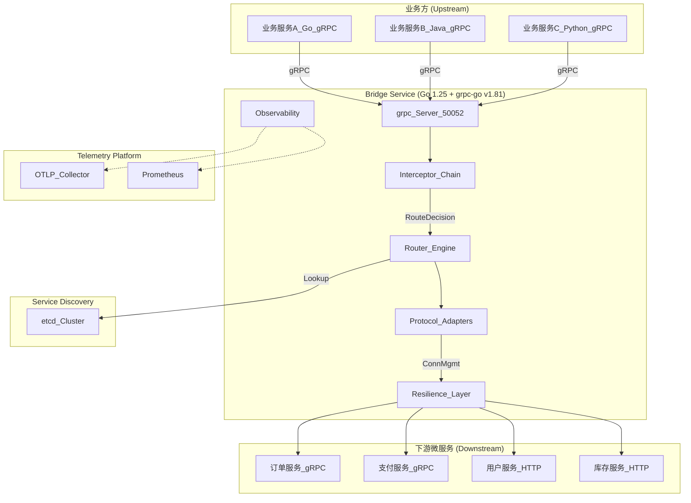
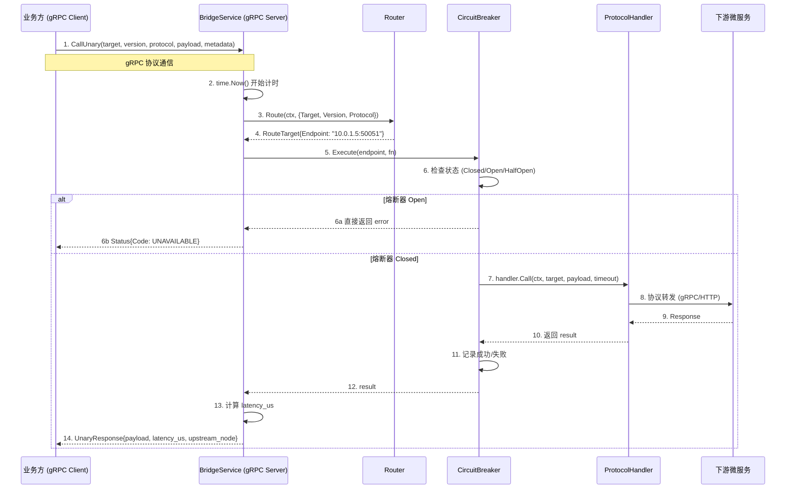

# Go gRPC Bridge 服务架构设计与实现

> **版本**: v3.2 (2026-06-19)  
> **Go 版本**: 1.25.9+  
> **依赖版本**: 与 `go.mod` 当前状态保持一致

---

## 目录

1. [架构概述](#1-架构概述)
2. [项目结构](#2-项目结构)
3. [Protobuf 定义](#3-protobuf-定义)
4. [核心模块实现](#4-核心模块实现)
5. [服务入口与启动](#5-服务入口与启动)
6. [配置文件](#6-配置文件)
7. [Makefile 与构建](#7-makefile-与构建)
8. [部署方案](#8-部署方案)
9. [调用方式与接入指南](#9-调用方式与接入指南)
10. [性能优化清单](#10-性能优化清单)
11. [附录：关键设计决策](#11-附录关键设计决策)

---

## 1. 架构概述

### 1.1 设计目标

Bridge 是业务方与下游微服务之间的统一 gRPC 代理层，核心职责包括：

- **统一协议入口**：业务方通过 gRPC 调用 Bridge，Bridge 转发到下游 gRPC/HTTP 微服务。
- **动态路由**：基于 `github.com/daheige/registry` 实现 etcd 服务发现，支持版本筛选与加权轮询。
- **稳定性保障**：熔断、限流、重试、超时，防止级联故障。
- **协议透明**：对外统一暴露 gRPC 接口，内部按 `protocol` 字段选择下游协议。
- **可观测性**：OpenTelemetry Trace + 结构化日志 + Prometheus 指标。

### 1.2 整体架构



### 1.3 核心数据流



### 1.4 技术选型

| 组件 | 选型 | 版本 | 理由 |
|------|------|------|------|
| gRPC 框架 | `google.golang.org/grpc` | **v1.81.1** | 当前 `go.mod` 锁定版本 |
| Protobuf | `google.golang.org/protobuf` | **v1.36.11** | 与 grpc-go v1.81 兼容 |
| etcd 客户端 | `go.etcd.io/etcd/client/v3` | **v3.6.12** | 当前 `go.mod` 锁定版本 |
| 服务注册/发现 | `github.com/daheige/registry` | **v1.1.0** | 独立 registry 库，统一服务模型 |
| 熔断器 | `github.com/sony/gobreaker/v2` | **v2.4.0** | 支持泛型，按 endpoint 维度隔离 |
| 限流 | `golang.org/x/time/rate` | **v0.12.0** | 标准扩展 |
| 可观测性 | `go.opentelemetry.io/otel` | **v1.44.0** | OTLP Trace 导出 |
| 日志 | `github.com/rs/zerolog` | **v1.35.1** | 零分配 JSON 日志 |
| HTTP 客户端 | `github.com/go-resty/resty/v2` | **v2.17.2** | 支持中间件、重试、拦截器 |
| 配置 | `github.com/spf13/viper` | **v1.21.0** | 支持热更新与环境变量覆盖 |
| Prometheus 客户端 | `github.com/prometheus/client_golang` | **v1.20.5** | 指标采集 |
| Go 版本 | `Go` | **1.25.9** | 当前 `go.mod` 声明版本 |

---

## 2. 项目结构

```
bridge-svc/
├── api/
│   └── v1/
│       ├── bridge.proto          # Bridge 对外 gRPC API 定义
│       ├── google/               # protobuf 公共依赖（any、rpc、api 等）
│       ├── bridge.pb.go          # protoc-gen-go 生成
│       └── bridge_grpc.pb.go     # protoc-gen-go-grpc 生成
├── client/
│   ├── main.go                   # 直连 Bridge 的 Go 客户端示例
│   └── resolver/
│       └── main.go               # 基于 etcd resolver 发现 Bridge 的示例
├── cmd/
│   └── bridge/
│       └── main.go               # 服务入口（加载配置、创建 Server、etcd 自注册、优雅关闭）
├── internal/
│   ├── config/
│   │   └── config.go             # 配置结构 + 热更新 + Get()
│   ├── server/
│   │   └── server.go             # grpc.Server 组装 + BridgeService 实现 + metrics HTTP
│   ├── router/
│   │   ├── router.go             # 路由决策（基于 registry.Discovery）
│   │   └── balancer.go           # 加权轮询负载均衡
│   ├── protocol/
│   │   ├── protocol.go           # 协议处理器接口
│   │   ├── grpc.go               # gRPC → gRPC 透传（raw-bytes codec + reflection）
│   │   └── http.go               # gRPC → HTTP 转换（使用 resty/v2）
│   ├── resilience/
│   │   ├── circuit.go            # 熔断器管理
│   │   ├── retry.go              # 重试策略
│   │   └── ratelimit.go          # 限流器
│   ├── pool/
│   │   └── grpcpool.go           # 下游 gRPC 连接缓存
│   ├── observability/
│   │   ├── tracing.go            # OpenTelemetry Trace
│   │   ├── metrics.go            # Prometheus 指标
│   │   ├── logging.go            # zerolog 初始化
│   │   └── init.go               # 可观测性统一初始化
│   └── middleware/
│       ├── chain.go              # 拦截器链组装
│       ├── auth.go               # 认证拦截器（占位）
│       ├── recovery.go           # Panic 恢复
│       └── logging.go            # 日志拦截器
├── config/
│   └── bridge.yaml               # 运行时配置
├── go.mod
├── go.sum
├── Makefile
├── Dockerfile
├── readme.md
├── bridge.md
└── k8s/
    └── deployment.yaml           # Kubernetes 部署示例
```

---

## 3. Protobuf 定义

### 3.1 `api/v1/bridge.proto`

完整定义见 [`api/v1/bridge.proto`](api/v1/bridge.proto)，核心字段如下：

```protobuf
service BridgeService {
  rpc CallUnary(UnaryRequest) returns (UnaryResponse);
  rpc CallStream(stream StreamRequest) returns (stream StreamResponse);
  rpc Health(HealthRequest) returns (HealthResponse);
}

message UnaryRequest {
  string target = 1;      // PackageName.ServiceName/MethodName
  string version = 2;     // 下游版本，空表示默认版本
  string protocol = 3;    // GRPC 或 HTTP
  google.protobuf.Any payload = 4;
  map<string, string> metadata = 5;
  uint32 timeout_ms = 6;  // 覆盖全局默认超时
  RetryPolicy retry = 7;  // 单次请求级重试策略
}

message UnaryResponse {
  google.protobuf.Any payload = 1;
  map<string, string> metadata = 2;
  google.rpc.Status status = 3;
  string upstream_node = 4;
  uint64 latency_us = 5;
}
```

### 3.2 生成命令

```bash
make proto
```

对应命令：

```bash
protoc -I api/v1 \
    --go_out=api/v1 --go_opt=paths=source_relative \
    --go-grpc_out=api/v1 --go-grpc_opt=paths=source_relative \
    api/v1/bridge.proto
```

---

## 4. 核心模块实现

### 4.1 `go.mod`

核心依赖见 [`go.mod`](go.mod)，主要包括：

- `google.golang.org/grpc` v1.81.1
- `google.golang.org/protobuf` v1.36.11
- `github.com/daheige/registry` v1.1.0
- `github.com/sony/gobreaker/v2` v2.4.0
- `github.com/spf13/viper` v1.21.0
- `go.opentelemetry.io/otel` v1.44.0
- `github.com/rs/zerolog` v1.35.1

### 4.2 `internal/config/config.go`

```go
type Config struct {
    Server        ServerConfig        `mapstructure:"server"`
    Etcd          EtcdConfig          `mapstructure:"etcd"`
    Protocols     ProtocolConfig      `mapstructure:"protocols"`
    Resilience    ResilienceConfig    `mapstructure:"resilience"`
    Observability ObservabilityConfig `mapstructure:"observability"`
}

type ServerConfig struct {
    ListenAddr           string        `mapstructure:"listen_addr"`
    MaxConcurrentStreams uint32        `mapstructure:"max_concurrent_streams"`
    KeepaliveTime        time.Duration `mapstructure:"keepalive_time"`
    KeepaliveTimeout     time.Duration `mapstructure:"keepalive_timeout"`
    ServiceName          string        `mapstructure:"service_name"`
    ServiceVersion       string        `mapstructure:"service_version"`
}

type EtcdConfig struct {
    Endpoints   []string      `mapstructure:"endpoints"`
    DialTimeout time.Duration `mapstructure:"dial_timeout"`
    Prefix      string        `mapstructure:"prefix"`
}

type ProtocolConfig struct {
    DefaultTimeout time.Duration `mapstructure:"default_timeout"`
    Grpc           GrpcConfig    `mapstructure:"grpc"`
    HTTP           HTTPConfig    `mapstructure:"http"`
}

type GrpcConfig struct {
    MaxSendMsgSize int           `mapstructure:"max_send_msg_size"`
    MaxRecvMsgSize int           `mapstructure:"max_recv_msg_size"`
    DialTimeout    time.Duration `mapstructure:"dial_timeout"`
}

type HTTPConfig struct {
    MaxConnsPerHost int           `mapstructure:"max_conns_per_host"`
    ReadTimeout     time.Duration `mapstructure:"read_timeout"`
    WriteTimeout    time.Duration `mapstructure:"write_timeout"`
}

type ResilienceConfig struct {
    CircuitBreaker CircuitBreakerConfig `mapstructure:"circuit_breaker"`
    RateLimiter    RateLimiterConfig    `mapstructure:"rate_limiter"`
    Retry          RetryConfig          `mapstructure:"retry"`
}

type ObservabilityConfig struct {
    LogLevel       string `mapstructure:"log_level"`
    TraceEndpoint  string `mapstructure:"trace_endpoint"`
    MetricsPort    int    `mapstructure:"metrics_port"`
    ServiceName    string `mapstructure:"-"` // 由 Server.ServiceName 注入
    ServiceVersion string `mapstructure:"-"` // 由 Server.ServiceVersion 注入
}
```

`Load` 使用 viper 加载配置文件，并通过 `OnConfigChange` 实现热更新：

```go
func Load(path string) (*Config, error) {
    v := viper.New()
    v.SetConfigFile(path)
    v.SetEnvPrefix("BRIDGE")
    v.AutomaticEnv()

    if err := v.ReadInConfig(); err != nil {
        return nil, fmt.Errorf("read config: %w", err)
    }

    var cfg Config
    if err := v.Unmarshal(&cfg); err != nil {
        return nil, fmt.Errorf("unmarshal config: %w", err)
    }

    v.OnConfigChange(func(in fsnotify.Event) {
        var newCfg Config
        if err := v.Unmarshal(&newCfg); err != nil {
            log.Error().Err(err).Msg("config hot reload failed")
            return
        }
        mu.Lock()
        instance = &newCfg
        mu.Unlock()
        log.Info().Msg("config reloaded")
    })
    v.WatchConfig()

    instance = &cfg
    return &cfg, nil
}
```

### 4.3 `internal/router/router.go`

当前 Router 依赖 `github.com/daheige/registry` 的 `Discovery` 接口，不直接操作 etcd：

```go
package router

import (
    "context"
    "fmt"
    "strings"

    "google.golang.org/grpc/metadata"

    "github.com/daheige/registry"
)

type ProtocolType = registry.ProtocolType

const (
    ProtocolGRPC = registry.ProtocolGRPC
    ProtocolHTTP = registry.ProtocolHTTP
)

type Endpoint = registry.Endpoint

type RouteContext struct {
    Target       string
    Version      string
    Protocol     ProtocolType
    Metadata     metadata.MD
    PreferRegion string
    Canary       string
}

type RouteTarget struct {
    ServiceName string
    MethodName  string
    Version     string
    Endpoint    Endpoint
}

type Router struct {
    discovery registry.Discovery
    balancer  LoadBalancer
}

func New(discovery registry.Discovery) (*Router, error) {
    if discovery == nil {
        return nil, fmt.Errorf("discovery is nil")
    }
    return &Router{
        discovery: discovery,
        balancer:  NewWeightedRoundRobin(),
    }, nil
}

func parseTarget(target string) (service, method string) {
    parts := strings.Split(target, "/")
    if len(parts) == 2 {
        return parts[0], parts[1]
    }
    return target, ""
}

func (r *Router) Route(ctx context.Context, routeCtx RouteContext) (*RouteTarget, error) {
    service, method := parseTarget(routeCtx.Target)
    version := routeCtx.Version

    endpoints, err := r.discovery.GetEndpoints(ctx, service, version)
    if err != nil {
        return nil, fmt.Errorf("lookup endpoints: %w", err)
    }

    healthy := filterHealthy(endpoints)
    if len(healthy) == 0 {
        return nil, fmt.Errorf("no healthy endpoint for %s", routeCtx.Target)
    }

    selected := r.balancer.Select(healthy, routeCtx)

    return &RouteTarget{
        ServiceName: service,
        MethodName:  method,
        Version:     version,
        Endpoint:    selected,
    }, nil
}
```

### 4.4 `internal/router/balancer.go`

```go
type LoadBalancer interface {
    Select(endpoints []Endpoint, ctx RouteContext) Endpoint
}

type WeightedRoundRobin struct {
    counter uint64
}

func NewWeightedRoundRobin() *WeightedRoundRobin { return &WeightedRoundRobin{} }

func (w *WeightedRoundRobin) Select(endpoints []Endpoint, ctx RouteContext) Endpoint {
    var totalWeight uint32
    for _, ep := range endpoints {
        totalWeight += ep.Weight
    }
    if totalWeight == 0 {
        return endpoints[0]
    }

    count := atomic.AddUint64(&w.counter, 1)
    pos := uint32((count - 1) % uint64(totalWeight))

    var current uint32
    for _, ep := range endpoints {
        current += ep.Weight
        if pos < current {
            return ep
        }
    }
    return endpoints[0]
}
```

### 4.5 `internal/protocol/protocol.go`

```go
type Handler interface {
    Call(ctx context.Context, target *router.RouteTarget, payload *anypb.Any,
         md metadata.MD, timeout time.Duration) (*Response, error)
}

type Response struct {
    Payload   *anypb.Any
    Metadata  metadata.MD
    LatencyUs uint64
}

func Factory(protocol registry.ProtocolType) Handler {
    switch protocol {
    case registry.ProtocolGRPC:
        return NewGRPCHandler()
    case registry.ProtocolHTTP:
        return NewHTTPHandler()
    default:
        return nil
    }
}
```

### 4.6 `internal/protocol/grpc.go`

核心流程：

1. 从 `GRPCPool` 获取到下游的连接。
2. 构造 gRPC full method name：`/PackageName.ServiceName/MethodName`。
3. 透传 metadata。
4. 使用 `rawBytesCodec` 直接透传 `Any.Value` 字节。
5. 调用下游服务。
6. 通过 gRPC Reflection 查询方法输出类型，填充 `Any.TypeUrl`（缓存）。
7. 返回 `protocol.Response`。

关键代码：

```go
func (h *GRPCHandler) Call(ctx context.Context, target *router.RouteTarget, payload *anypb.Any,
    md metadata.MD, timeout time.Duration) (*Response, error) {
    start := time.Now()

    conn, err := h.pool.Get(ctx, target.Endpoint.Address)
    if err != nil {
        return nil, fmt.Errorf("get connection to downstream %s: %w", target.Endpoint.Address, err)
    }
    defer h.pool.Put(conn)

    service := strings.TrimPrefix(target.ServiceName, "/")
    service = strings.TrimSuffix(service, "/")
    method := fmt.Sprintf("/%s/%s", service, target.MethodName)

    ctx = metadata.NewOutgoingContext(ctx, md)
    ctx, cancel := context.WithTimeout(ctx, timeout)
    defer cancel()

    reqBytes := payload.GetValue()
    var respBytes []byte
    err = conn.Invoke(ctx, method, reqBytes, &respBytes, grpc.ForceCodec(&rawBytesCodec{}))

    latency := uint64(time.Since(start).Microseconds())
    if err != nil {
        return nil, fmt.Errorf("invoke downstream %s: %w", method, err)
    }

    respAny := &anypb.Any{Value: respBytes}
    reflectCtx, reflectCancel := context.WithTimeout(context.Background(), 2*time.Second)
    defer reflectCancel()
    outputType, typeErr := h.typeCache.getOutputType(reflectCtx, conn, target.Endpoint.Address, method)
    if typeErr != nil {
        log.Printf("warn: failed to get output type via reflection for %s: %v", method, typeErr)
    } else if outputType != "" {
        respAny.TypeUrl = "type.googleapis.com/" + outputType
    }

    return &Response{
        Payload:   respAny,
        Metadata:  metadata.MD{},
        LatencyUs: latency,
    }, nil
}
```

### 4.7 `internal/protocol/http.go`

HTTP Handler 将 gRPC 请求转换为 HTTP POST 请求：

```go
func (h *HTTPHandler) Call(ctx context.Context, target *router.RouteTarget, payload *anypb.Any,
    md metadata.MD, timeout time.Duration) (*Response, error) {
    start := time.Now()

    service := strings.TrimPrefix(target.ServiceName, "/")
    service = strings.TrimSuffix(service, "/")
    url := fmt.Sprintf("http://%s/%s/%s", target.Endpoint.Address, service, target.MethodName)

    req := h.client.R().SetContext(ctx)
    for k, v := range md {
        if len(v) > 0 {
            req.SetHeader(k, v[0])
        }
    }
    req.SetHeader("Content-Type", "application/octet-stream")
    if payload != nil {
        req.SetBody(payload.Value)
    }

    resp, err := req.Post(url)
    latency := uint64(time.Since(start).Microseconds())
    if err != nil {
        return nil, fmt.Errorf("http call to %s: %w", target.Endpoint.Address, err)
    }

    return &Response{
        Payload:   &anypb.Any{Value: resp.Body()},
        Metadata:  metadata.MD{},
        LatencyUs: latency,
    }, nil
}
```

### 4.8 `internal/pool/grpcpool.go`

```go
type GRPCPool struct {
    mu    sync.RWMutex
    conns map[string]*grpc.ClientConn
}

func NewGRPCPool() *GRPCPool {
    return &GRPCPool{conns: make(map[string]*grpc.ClientConn)}
}

func (p *GRPCPool) Get(ctx context.Context, addr string) (*grpc.ClientConn, error) {
    addr = strings.TrimPrefix(addr, "http://")
    addr = strings.TrimPrefix(addr, "https://")

    p.mu.RLock()
    conn, ok := p.conns[addr]
    p.mu.RUnlock()

    if ok && p.isHealthy(conn) {
        return conn, nil
    }

    p.mu.Lock()
    defer p.mu.Unlock()

    if conn, ok := p.conns[addr]; ok && p.isHealthy(conn) {
        return conn, nil
    }

    newConn, err := grpc.NewClient(addr,
        grpc.WithTransportCredentials(insecure.NewCredentials()),
        grpc.WithDefaultServiceConfig(`{"loadBalancingPolicy":"round_robin"}`),
        grpc.WithKeepaliveParams(keepalive.ClientParameters{
            Time:    10 * time.Second,
            Timeout: 3 * time.Second,
        }),
        grpc.WithDefaultCallOptions(
            grpc.MaxCallRecvMsgSize(16<<20),
            grpc.MaxCallSendMsgSize(16<<20),
        ),
    )
    if err != nil {
        return nil, fmt.Errorf("dial %s: %w", addr, err)
    }

    p.conns[addr] = newConn
    return newConn, nil
}

func (p *GRPCPool) isHealthy(conn *grpc.ClientConn) bool {
    state := conn.GetState()
    return state == connectivity.Ready || state == connectivity.Idle
}
```

### 4.9 `internal/resilience/circuit.go`

```go
type CircuitBreakerManager struct {
    breakers sync.Map // endpoint -> *gobreaker.CircuitBreaker[interface{}]
    cfg      config.CircuitBreakerConfig
}

func (m *CircuitBreakerManager) Get(endpoint string) *gobreaker.CircuitBreaker[interface{}] {
    if cb, ok := m.breakers.Load(endpoint); ok {
        return cb.(*gobreaker.CircuitBreaker[interface{}])
    }

    settings := gobreaker.Settings{
        Name:        endpoint,
        MaxRequests: m.cfg.HalfOpenMax,
        Interval:    m.cfg.Interval,
        Timeout:     m.cfg.Timeout,
        ReadyToTrip: func(counts gobreaker.Counts) bool {
            failureRatio := float64(counts.TotalFailures) / float64(counts.Requests)
            return counts.Requests >= 3 && failureRatio >= m.cfg.FailureRatio
        },
    }

    cb := gobreaker.NewCircuitBreaker[interface{}](settings)
    actual, _ := m.breakers.LoadOrStore(endpoint, cb)
    return actual.(*gobreaker.CircuitBreaker[interface{}])
}

func (m *CircuitBreakerManager) Execute(endpoint string, fn func() (interface{}, error)) (interface{}, error) {
    cb := m.Get(endpoint)
    result, err := cb.Execute(fn)
    if err == gobreaker.ErrOpenState {
        return nil, ErrCircuitOpen
    }
    return result, err
}
```

### 4.10 重试与限流

- `internal/resilience/retry.go`：指数退避重试。
- `internal/resilience/ratelimit.go`：令牌桶限流，已实现但未接入默认拦截器链，可按需开启。

### 4.11 `internal/middleware/chain.go`

```go
func ChainUnaryServer(interceptors ...grpc.UnaryServerInterceptor) grpc.UnaryServerInterceptor {
    n := len(interceptors)
    return func(ctx context.Context, req interface{}, info *grpc.UnaryServerInfo, handler grpc.UnaryHandler) (interface{}, error) {
        chain := handler
        for i := n - 1; i >= 0; i-- {
            interceptor := interceptors[i]
            next := chain
            chain = func(currentCtx context.Context, currentReq interface{}) (interface{}, error) {
                return interceptor(currentCtx, currentReq, info, func(nestedCtx context.Context, nestedReq interface{}) (interface{}, error) {
                    return next(nestedCtx, nestedReq)
                })
            }
        }
        return chain(ctx, req)
    }
}
```

当前默认链路（从外到内）：`RecoveryInterceptor` → `LoggingInterceptor`。`AuthInterceptor` 与 `RateLimitInterceptor` 已实现但默认未启用。

### 4.12 `internal/observability/metrics.go`

```go
var (
    RequestTotal = promauto.NewCounterVec(prometheus.CounterOpts{
        Name: "bridge_request_total",
        Help: "Total number of requests from upstream",
    }, []string{"method", "status"})

    RequestDuration = promauto.NewHistogramVec(prometheus.HistogramOpts{
        Name:    "bridge_request_duration_seconds",
        Help:    "Request duration in seconds (upstream to downstream)",
        Buckets: prometheus.DefBuckets,
    }, []string{"method"})

    ActiveConnections = promauto.NewGauge(prometheus.GaugeOpts{
        Name: "bridge_active_connections",
        Help: "Number of active connections from upstream",
    })
)
```

---

## 5. 服务入口与启动

### 5.1 `internal/server/server.go`

当前实现为 `NewServer` / `Start` / `Stop` / `Addr` 结构，便于在 `cmd/bridge/main.go` 中获取监听地址后注册到 etcd。

```go
type Server struct {
    gs     *grpc.Server
    lis    net.Listener
    bridge *BridgeServer
    cfg    *config.Config
}

func NewServer(cfg *config.Config) (*Server, error) {
    opConf := cfg.Observability
    opConf.ServiceName = cfg.Server.ServiceName
    opConf.ServiceVersion = cfg.Server.ServiceVersion
    if err := observability.Init(opConf); err != nil {
        return nil, fmt.Errorf("init observability: %w", err)
    }

    bridge, err := New(cfg)
    if err != nil {
        return nil, err
    }

    chain := middleware.ChainUnaryServer(
        middleware.RecoveryInterceptor,
        middleware.LoggingInterceptor,
        // middleware.AuthInterceptor,
        // middleware.RateLimitInterceptor,
    )

    gs := grpc.NewServer(
        grpc.MaxConcurrentStreams(cfg.Server.MaxConcurrentStreams),
        grpc.UnaryInterceptor(chain),
        grpc.KeepaliveParams(keepalive.ServerParameters{
            MaxConnectionIdle:     cfg.Server.KeepaliveTime,
            MaxConnectionAgeGrace: cfg.Server.KeepaliveTimeout,
        }),
    )

    bridgev1.RegisterBridgeServiceServer(gs, bridge)
    reflection.Register(gs)

    // metrics HTTP server
    go func() {
        mux := http.NewServeMux()
        mux.Handle("/metrics", promhttp.Handler())
        addr := fmt.Sprintf(":%d", cfg.Observability.MetricsPort)
        log.Info().Str("addr", addr).Msg("metrics server starting")
        if err := http.ListenAndServe(addr, mux); err != nil {
            log.Error().Err(err).Msg("metrics server failed")
        }
    }()

    lis, err := net.Listen("tcp", cfg.Server.ListenAddr)
    if err != nil {
        return nil, fmt.Errorf("listen: %w", err)
    }

    return &Server{gs: gs, lis: lis, bridge: bridge, cfg: cfg}, nil
}

func (s *Server) Addr() string { ... }
func (s *Server) Start() error { return s.gs.Serve(s.lis) }
func (s *Server) Stop()        { s.gs.GracefulStop() }
```

### 5.2 `cmd/bridge/main.go`

```go
func main() {
    cfg, err := config.Load("config/bridge.yaml")
    if err != nil {
        log.Fatal().Err(err).Msg("load config failed")
    }

    srv, err := server.NewServer(cfg)
    if err != nil {
        log.Fatal().Err(err).Msg("create server failed")
    }

    advertiseAddr := toAdvertiseAddr(srv.Addr())

    serviceName := cfg.Server.ServiceName
    if serviceName == "" {
        serviceName = "bridge-svc"
    }

    reg, err := etcd.NewServiceRegistry(
        cfg.Etcd.Endpoints,
        cfg.Etcd.Prefix,
        serviceName,
        registry.Endpoint{
            Address:  advertiseAddr,
            Protocol: registry.ProtocolGRPC,
            Version:  cfg.Server.ServiceVersion,
            Healthy:  true,
            Weight:   100,
            Tags: map[string]string{
                "service": serviceName,
                "version": cfg.Server.ServiceVersion,
            },
        },
        etcd.WithTTL(10),
    )
    if err != nil {
        log.Fatal().Err(err).Msg("create etcd registry failed")
    }

    if err := reg.Register(); err != nil {
        log.Fatal().Err(err).Msg("register bridge-svc to etcd failed")
    }

    sigCh := make(chan os.Signal, 1)
    signal.Notify(sigCh, syscall.SIGINT, syscall.SIGTERM)

    errCh := make(chan error, 1)
    go func() { errCh <- srv.Start() }()

    defer func() {
        srv.Stop()
        log.Info().Msg("bridge-svc stopped")
    }()

    select {
    case err := <-errCh:
        if err != nil {
            log.Fatal().Err(err).Msg("server error")
        }
    case sig := <-sigCh:
        log.Info().Str("signal", sig.String()).Msg("shutdown signal received, graceful shutdown")
    }

    if err := reg.Deregister(); err != nil {
        log.Error().Err(err).Msg("deregister bridge-svc from etcd failed")
    }
}
```

`toAdvertiseAddr` 将 `0.0.0.0` / `::` 通配地址替换为 `127.0.0.1`，便于本地 etcd 发现测试；生产环境建议配置独立的 `advertise_addr`。

---

## 6. 配置文件

### 6.1 `config/bridge.yaml`

```yaml
server:
  listen_addr: "0.0.0.0:50052"
  max_concurrent_streams: 10000
  keepalive_time: 7200s
  keepalive_timeout: 20s
  service_name: "bridge-svc"
  service_version: "v1"

etcd:
  endpoints:
    - "http://127.0.0.1:12379"
  dial_timeout: 5s
  prefix: "/services/"

protocols:
  default_timeout: 30s
  grpc:
    max_send_msg_size: 16777216
    max_recv_msg_size: 16777216
    dial_timeout: 10s
  http:
    max_conns_per_host: 100
    read_timeout: 10s
    write_timeout: 10s

resilience:
  circuit_breaker:
    max_requests: 3
    interval: 10s
    timeout: 30s
    failure_ratio: 0.6
    success_ratio: 0.5
    half_open_max: 1
  rate_limiter:
    rps: 10000
    burst_size: 500
  retry:
    max_attempts: 3
    initial_backoff: 100ms
    max_backoff: 5s
    backoff_multiplier: 2.0

observability:
  log_level: "info"
  trace_endpoint: "localhost:5081"
  metrics_port: 9090
```

### 6.2 环境变量覆盖

前缀 `BRIDGE_`，viper 自动映射嵌套字段，例如：

```bash
BRIDGE_SERVER_LISTEN_ADDR="0.0.0.0:50051"
BRIDGE_ETCD_ENDPOINTS="etcd-0:2379,etcd-1:2379,etcd-2:2379"
BRIDGE_OBSERVABILITY_TRACE_ENDPOINT="otel-collector.monitoring:4317"
```

---

## 7. Makefile 与构建

### 7.1 `Makefile`

```makefile
.PHONY: all build proto test clean docker

BINARY_NAME=bridge-svc
DOCKER_IMAGE=your-registry/bridge-svc
VERSION=$(shell git describe --tags --always --dirty)

all: proto build

proto:
	@protoc -I api/v1 \
	    --go_out=api/v1 --go_opt=paths=source_relative \
	    --go-grpc_out=api/v1 --go-grpc_opt=paths=source_relative \
	    api/v1/bridge.proto

build:
	@go build -ldflags "-X main.version=$(VERSION)" -o bin/$(BINARY_NAME) ./cmd/bridge

test:
	@go test -v -race ./...

clean:
	@rm -rf bin/
	@rm -f api/v1/*.pb.go

docker:
	@docker build -t $(DOCKER_IMAGE):$(VERSION) -t $(DOCKER_IMAGE):latest .

run: build
	@./bin/$(BINARY_NAME)

fmt:
	@gofmt -w -s .
	@goimports -w .

lint:
	@golangci-lint run ./...

deps:
	@go get -u ./...
	@go mod tidy
	@go mod verify
```

### 7.2 `Dockerfile`

```dockerfile
FROM golang:1.24-alpine AS builder

WORKDIR /app
COPY go.mod go.sum ./
RUN go mod download

COPY . .
RUN go build -ldflags "-w -s" -o bridge-svc ./cmd/bridge

FROM alpine:latest

RUN apk --no-cache add ca-certificates
WORKDIR /app/

COPY --from=builder /app/bridge-svc /app/bridge-svc
COPY config/bridge.yaml ./config/

EXPOSE 50051 9090

ENTRYPOINT ["/app/bridge-svc"]
```

> 注意：Dockerfile 默认暴露 gRPC 端口 `50051`，与本地 `config/bridge.yaml` 中的 `50052` 不同，容器运行时请通过环境变量统一。

---

## 8. 部署方案

### 8.1 Kubernetes

参考 `k8s/deployment.yaml`，包含 Deployment、Service、ConfigMap：

- namespace: `infrastructure`
- replicas: `3`
- 端口：`50051`（gRPC）、`9090`（metrics）
- 探针：gRPC 健康检查，端口 `50051`
- Prometheus 抓取注解：`prometheus.io/scrape: "true"`
- 资源：requests `512Mi/500m`，limits `2Gi/2000m`
- 配置通过 `BRIDGE_*` 环境变量覆盖 ConfigMap

```bash
kubectl apply -f k8s/deployment.yaml
```

---

## 9. 调用方式与接入指南

### 9.1 业务方调用 Bridge（Go 示例）

```go
resp, err := client.CallUnary(ctx, &bridgev1.UnaryRequest{
    Target:   "Hello.Greeter/SayHello",
    Version:  "",
    Protocol: "GRPC",
    Payload:  payload,
    Metadata: map[string]string{
        "authorization": "Bearer token123",
        "x-request-id":  "req-456",
    },
    TimeoutMs: 3000,
})
```

### 9.2 通过 etcd resolver 发现 Bridge

```go
discovery, err := etcd.NewEtcdDiscovery(
    []string{"localhost:12379"},
    "/services",
    5*time.Second,
)
etcd.RegisterEtcdResolver(discovery, "etcd")

conn, err := grpc.NewClient(
    "etcd:///bridge-svc/v1",
    grpc.WithDefaultServiceConfig(`{"loadBalancingConfig": [{"round_robin":{}}]}`),
    grpc.WithTransportCredentials(insecure.NewCredentials()),
)
```

### 9.3 下游微服务注册到 etcd

使用独立库 `github.com/daheige/registry`：

```go
import (
    "github.com/daheige/registry"
    "github.com/daheige/registry/etcd"
)

reg, err := etcd.NewServiceRegistry(
    []string{"127.0.0.1:2379"},
    "/services/",
    "Hello.Greeter",
    registry.Endpoint{
        Address:  "127.0.0.1:50051",
        Weight:   100,
        Protocol: registry.ProtocolGRPC,
        Version:  "v1",
        Healthy:  true,
    },
)
if err != nil { log.Fatal(err) }
if err := reg.Register(); err != nil { log.Fatal(err) }
defer reg.Deregister()
```

### 9.4 target 解析规则

- `target` 格式：`"ServiceName/MethodName"`
- `version` 独立字段，如 `"v1"`
- 示例：
  - `Target: "Hello.Greeter/SayHello"`, `Version: ""`
  - `Target: "Hello.Greeter/SayHello"`, `Version: "v1"`

### 9.5 grpcurl 调试

```bash
grpcurl -plaintext localhost:50052 list
grpcurl -plaintext localhost:50052 bridge.v1.BridgeService/Health
grpcurl -plaintext -d '{
  "target": "Hello.Greeter/SayHello",
  "version": "",
  "protocol": "GRPC",
  "timeout_ms": 3000
}' localhost:50052 bridge.v1.BridgeService/CallUnary
```

---

## 10. 性能优化清单

| 优化点 | 实现方式 | 预期收益 |
|--------|---------|---------|
| 零拷贝透传 | `rawBytesCodec` 直接透传 `[]byte` | 减少 CPU 和内存开销 |
| 反射类型缓存 | `methodTypeCache` 缓存下游方法输出类型 | 避免每次请求进行 gRPC Reflection |
| 零分配日志 | `zerolog` 结构化 JSON 日志 | 日志路径低分配 |
| 连接复用 | `grpc.ClientConn` 按地址缓存 | 避免重复 TCP 握手 |
| 无锁缓存 | `sync.Map` 存储连接池 | 减少锁竞争 |
| 本地路由表 | `registry.Discovery` 内部缓存 + Watch | 查询路径无网络 I/O |

---

## 11. 附录：关键设计决策

### A. 通信路径

- 业务方 → Bridge：统一 gRPC（HTTP/2）。
- Bridge → 下游：根据 `protocol` 选择 gRPC 或 HTTP。

### B. 错误处理策略

- 所有错误通过响应体中的 `google.rpc.Status` 返回。
- gRPC 层正常返回 `nil` error，便于统一重试和降级。

### C. 协议透传设计

- `google.protobuf.Any` + 自定义 `rawBytesCodec`。
- gRPC 场景下 Bridge 不反序列化业务消息。
- 通过下游 gRPC Reflection 填充 `TypeUrl`，业务方使用 `UnmarshalTo` 解包。
- 下游未开启 Reflection 时，可降级为 `proto.Unmarshal(resp.Payload.Value, &res)`。

### D. 熔断器粒度

- 按下游 endpoint 地址维度隔离。
- 单个节点故障不影响其他节点。

### E. 服务发现

- 依赖外部 `github.com/daheige/registry` 库。
- Bridge 内部不直接操作 etcd，仅依赖 `registry.Discovery` 接口。

### F. 版本说明

主要依赖版本见 [1.4 技术选型](#14-技术选型)，以 `go.mod` 为准。

---

*文档版本: v3.2 | 最后更新: 2026-06-19*  
*Go 版本: 1.25.9+ | 依赖版本: 与 go.mod 保持一致*
